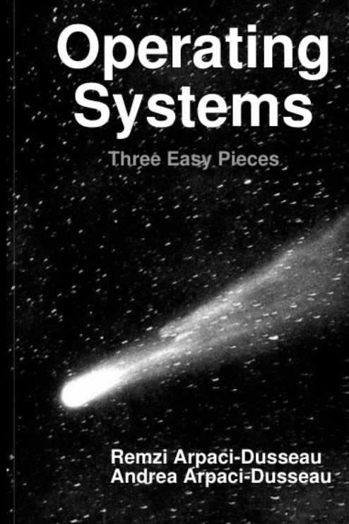

# 🖥️ 42_Study_OperatingSystem

<h1>$\Huge{\color{#FF0062} 지각자 명단 }$</h1>

<h2>$\Huge{\rm{\color{#5ad7b7} 김동휘 }}$</h2>
<h2>$\LARGE{\rm{\color{#5ad7b7} 오언서 }}$</h2>

위 두 사람은 7/3일 스터디 마감일에 지각하였기에, 일주일간 불명예 전당에 이름을 올려드리겠습니다.  
다만, 아직 스터디 운영이 미흡한 점과, 두 사람 모두 2/3 이상을 하였음을 고려하여 강제 퇴장 카운트는 하지 않도록 하겠습니다.  
7/4일 오전 6시 이전까지 push를 완료해 주신다면 이름을 내리도록 하겠습니다! 화이팅!! \* ^ - ^ \*
 
## 📖 교재
[운영체제 아주 쉬운 세 가지 이야기 (Operating Systems: Three Easy Pieces)](https://github.com/remzi-arpacidusseau/ostep-translations/blob/master/korean/README.md)

## 🔖 참고링크
[카이스트 PPT 및 강의 영상(영어)](https://oslab.kaist.ac.kr/ostepslides/)

[hyebinle 대학 강의 정리 ppt](https://drive.google.com/drive/folders/1vT34g2l9i_noHckwYwRc2xOWAeEPn56j?usp=share_link)

[markdown 형식 정리](https://docs.github.com/ko/get-started/writing-on-github/getting-started-with-writing-and-formatting-on-github/basic-writing-and-formatting-syntax)

## 📆 일정
> 0주차 ( 시범기간: 6/24 ~ 7/3)

| **4 장** | **5 장** | **6 장** |
|:---------:|:-------:|:--------:|
|   [프로세스][r프로세스]  |   [프로세스API][r프로세스API]  |   [제한적][r제한적]  |
|   퀴즈  |   퀴즈  |   퀴즈  |

[r프로세스]: docs/04_프로세스_개념
[r프로세스API]: docs/05_프로세스_API
[r제한적]: docs/06_제한적_직접_실행
