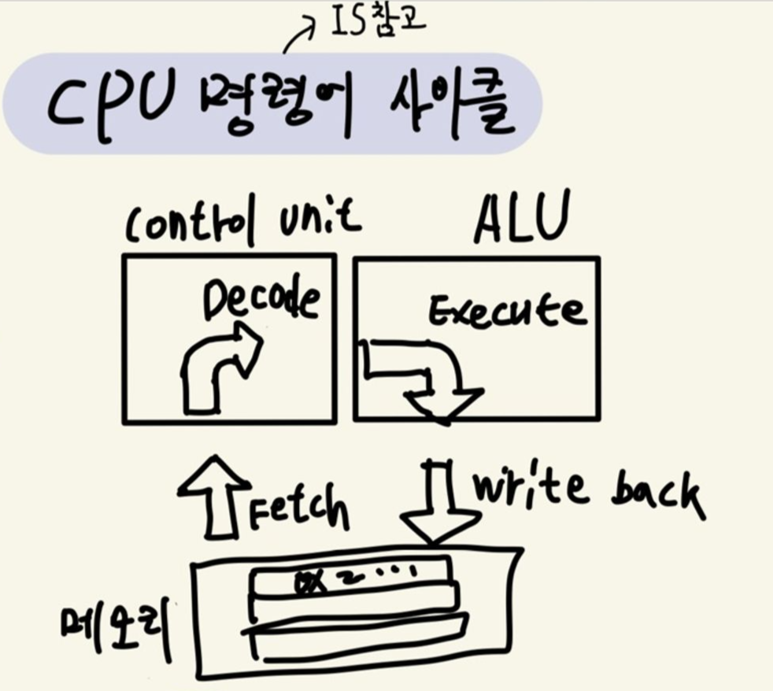

여기서 부르는 **메모리는 RAM**을 뜻한다.

<aside>
💡 **CPU 하나 당 프로그램 하나** 밖에 실행할 수 없다. **어떻게 여러 프로그램을 실행**하는가?

→ **CPU 가상화**, **CPU가 여러 개인 것처럼 보이게** 만든다.

</aside>

## CPU 가상화를 어떻게 이루는 가?

<aside>
💡 **시분할(Time sharing) 기법** : 현대 운영체제들이 모두 채택

시간을 분할한다는 것은 공유한다는 것, **프로세스를 하나의 개체**로 보자

CPU라는 자원을 개체들이 공유해서 사용하는 것

</aside>

메커니즘(mechanism)과 운영체제 정책이 필요하다.

**메커니즘(mechanism)** 

1. 문맥 교환(context switch)
2. 어떻게

**운영체제 정책**

1. 스케줄링 정책(scheduling policy)
2. 어느 것

둘을 분리해서 구현해야 편리하다. 

## 프로세스

**프로그램**

→ 디스크 안에 보관될 때

**프로세스**

→  메모리에 올라온 실행 중인 프로그램 

RAM과 레지스터가 중요하다. 프로그램을 실행하기 위해 읽고 쓰기 위함

- 참고 : 프로세스 메모리 구조
    
    
    
- 참고 : CPU 명령어 사이클
    
    
    

23 45 FF A9

## 프로세스 API

생성 (Create)

운영체제는 새로운 프로세스를 생성할 수 있는 방법을 제공해야 한다. ex) fork()

제거 (Destroy)

프로세스 생성 인터페이스를 제공하는 것처럼 운영체제는 프로세스를 강제로 제거할 수 있는 인터페이스를 제공해야 한다.  ex) exit()

대기 (Wait)

때론 어떤 프로세스의 실행 중지를 기다릴 필요가 있기 때문에 여러 종류의 대기 인터페이스가 제공된다. ex) waitpid(), wait(), sleep()

각종 제어 (Miscellaneous Control)

 프로세스의 제거, 대기 이외에, 여러 가지 제어 기능들이 제공된다.  

상태 (Status)

프로세스 상태 정보를 얻어내는 인터페이스도 제공된다. ex) getpid(), times()

## 프로세스 생성

현대 운영체제는 필요할 때 **필요한 부분만 디스크에서 읽어 메모리에 올린다**.

순서

1. 실행 파일(코드, 정적 데이터)를 메모리에 올린다.
2. bss, heap, stack을 생성하여 초기화 한다.
3. 입출력 셋업과 관련된 다른 작업을 한다.
4. main에서 프로그램을 실행한다. 

## 프로세스 상태

- 실행 (Running)
    - 실행 상태에서 **프로세스는 프로세서(CPU)에서 실행 중**
- 준비 (Ready)
    - 실행 준비가 완료된 상태, **CPU 할당 받기를 기다리는 중**이다.
- 대기 (Blocked)
    - 프로세스가 **다른 사건**을 기다리는 동안 프로세스를 잠시 중단시킨다.
    - ex) 입출력 요청을 하고 입출력이 완료될 때까지


스케줄링 정책에 따라 상태를 전이한다. 

- 프로세스 제어 블록(Process Control Block : PCB)
    - 프로세스 관리를 위한 정보가 담겨져 있다.

이 외의 

- 초기(initial) 상태를 가지는 시스템도 있다
- 프로세스는 종료되었지만 메모리에 남아있는 상태인 최종(inal) or 좀비(zombie)상태도 있다.
    - 프로세스가 성공적으로 실행했는지를 판단할 때 사용한다.

## 자료 구조

- 프로세스 리스트(process list)
    - 준비 상태의 프로세스들을 담아둔다.
- 레지스터 문맥(register context)
    - 레지스터 값을 저장 해놓는 자료구조

프로세스를 중단시키고 다시 실행할 때, 위의 자료 구조를 이용한다.

- xv6 커널 예시
    
    ```c
    
    // 레지스터 저장
    struct context {
    		int eip;
    		int esp;
    		int ebx;
    		int ecx;
    		int edx;
    		int esi;
    		int edi;
    		int ebp;
    };
    
    // 프로세스 상태
    enum proc_state { UNUSED, EMBRYO, SLEEPING,
    RUNNABLE, RUNNING, ZOMBIE };
    
    // 레지스터 문맥과 상태 포함
    struct proc {
    		char *mem;           // 프로세스 메모리 시작 주소
    		unsigned int sisz;   // 프로세스 메모리 크기
    		char *kstack;           // 프로세스 커널 스택의 바닥 주소
    		enum proc_state state;  // 프로세스 상태
    		int pid;                // 프로세스 ID 
    		struct proc *parent;    // 부모 프로세스
    		void *chan;             //  0 아니면, chan에서 수면
    		int killed;             //  0 아니면, 종료됨
    		struct file *ofile[NOFILE];  // 열린 파일
    		struct inode *cwd;           // 현재 디렉토리
    		struct context context;      // 프로세스를 실행시키려면 여기로 교환
    		struct trapframe *tf;        // 현재 인터럽트에 해당하는 트랩 프레임
    };
    ```
    

- 이후에 배울 내용
    
    **페이징(paging)**과 **스와핑(swapping)**을 알아야 이해가 쉽다.  → 가상화 
    
    파일 디스크립터 → 영속성 
    
    공간 분할 기법