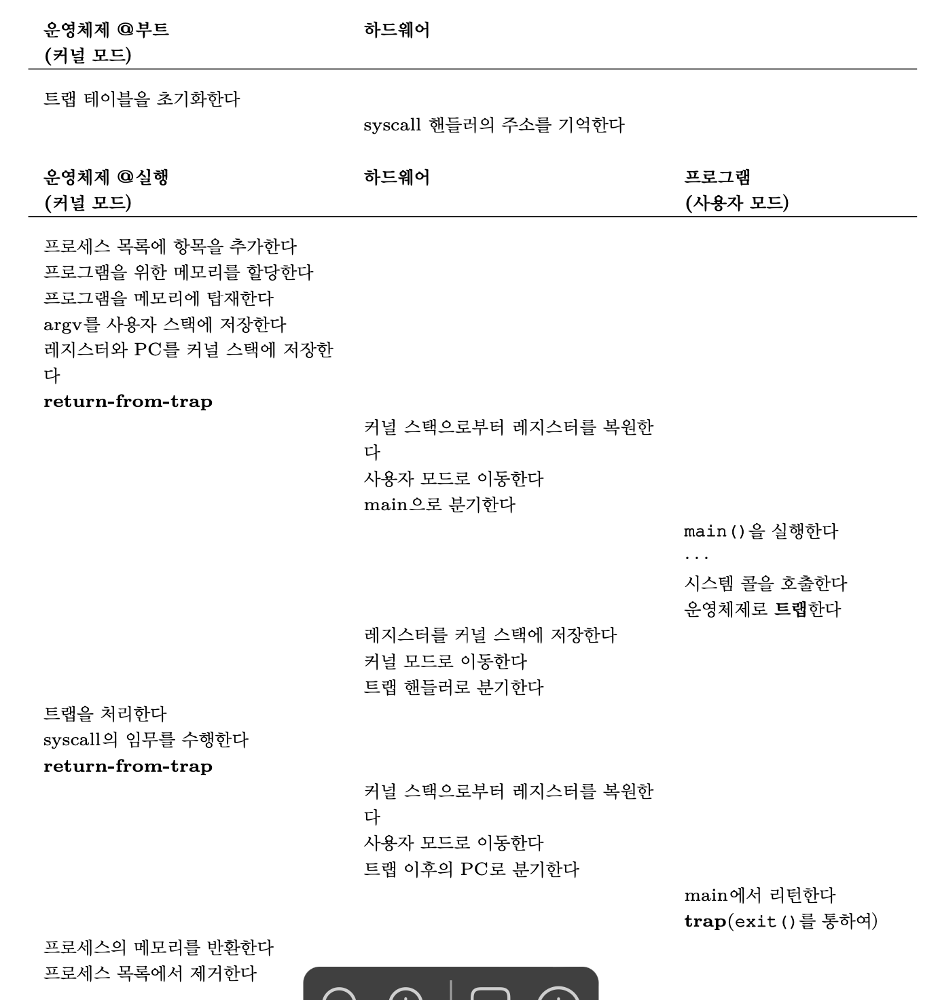

# 제한적 직접 실행 원리 (Limited Direct Execution)

> cpu를 가상화 하기 위해 cup의 시간을 나누어 씀으로써 가상화를 할 수 있다.  
>> cpu가상화란?  
cpu가 마치 여러개 존재한다는 듯한 **환상**을 제공하는 것.  

> 하지만 이를 위해 해결해야 하는 몇가지 문제  
> 1. 성능 저하
> 2. 제어 문제

## 운영체제 == 자원관리의 책임자

## 핵심 과제 :  어떻게 해야 운영체제를 제어권을 유지하면서 성능 저하가 없도록 구축할 수 있을까? 

## 9.1 기본 원리 : 제한적 직접 실행(LDE)
> 프로그램을 CPU상에서 그냥 직접 실행 시키는 것.

<실행 과정> - 기본적인 LDE의 예시

운영체제 | 프로그램  
----- | ----
프로세스 목록의 항목을 생성 | 
프로그램 메모리 할당 | 
메모리에 프로그램 탑재 | 
argc/argv를 위한 스택 셋업 | 
레지스터 내용 삭제 |  
call main() 실행 |   
 | | main() 실행  
 | | main()에서 return 명령어 실행  
 프로세스 메모리 반환 | 
 프로세스 목룍에서 항목 제거 | 

위 예시에서 OS는 main()에서 분기하고, return후에 커널로 돌아감.  
간단하지만 이 방식은 CPU가상화에서 몇가지 문제가 있음.  

1. 프로그램을 직접 실행 시킬 때 이 프로그램이 올바르지 않은 일을 하지 않는 다는 것을 어떻게 보장할 수 있는가?
2. 프로세스 실행 시 운영체제는 어떻게 프로그램의 실행을 중단하고 다른 프로세스로 전환할 수 있는가? -> 즉, CPU가상화에서 필요한  time sharing  을 어떻게 구현할 수 있는가?

 

> 이처럼 프로그램 실행에 제한을 두지 않으면 운영제제는 어떠한 것도 제어할 수 없으며, 그저 단순한 라이브러리가 될 뿐이다.

## 9.2 문제점 1: 제한된 연산

직접 실행의 장점 : 빠름  
직접 실행의 단점 : 문제 많음  

**해결방안 : user mode, kernel mode 도입**  
user mode에서 실행되는 코드는 할 수 있는 일이 제한됨.  

	ex) 프로세스는 사용자 모드에서 입출력 요청을 할 수 없도록 설정하면, 입출력 요청이 발생했을 때 프로세서가 예외를 발생시키고, 운영체제는 해당 프로세스를 제거한다.

kernel mode에서는 사용자 모드와 대비되는 모드. 운영체제의 중요한 코드들이 실행됨. 이 모드에서는 특후한 명령어를 포함하여 원하는 모든 작업을 수행 가능.  

그러나 문제. 사용자 프로세스가 특권 명령어(ex. 디스크 읽기)를 실행해야 할 때는 어떻게 해야 하는가?  
-> 하드웨어가 제공하는 **시스템 콜** 사용  

	시스템 콜 예시 : 파일 시스템 접근, 프로세스 생성 및 제거, 다른 프로세스와의 통신 및 메모리 할당 등등...

시스템 콜을 실행하기 위해 프로그램은 `trap` 특수 명령어를 실행.  
`trap` 명령어는 커널 안으로 분기하는 동시에 권한을 커널 모드로 바꿈.  
커널 모드에 진입한 다음 요청한 작업을 수행하고, 완료 후 운영체제는 `return-from-trap` 명령어를 호출하여 권한을 사용자 모드로 바꾸고, 커널 모드 호출 직전의 사용자 프로그램으로 리턴함.

하드웨어는 trap 명령어를 수행할 때 주의가 필요하다.  
운영체제가 `return-from-trap`명령어 실행 시 사용자 프로세스로 `제대로 리턴`할 수 있도록 호출한 프로세스의 필요한 레지스터를 저장해야 함.  

예를 들어 프로그램 카운터, 플래그 등 몇가지 레지스터를 각 프로세스의 **커널 스택**에 저장함. 이후 `return-from-trap`명령어가 이 값들을 스택에서 pop하여 사용자 모드 프로그램의 실행을 다시 시작한다.

---
 

> 그렇다면 `trap` 명령어는 운영체제 코드의 어디 를 실행할지 어떻게   알 까? - 운영체제가 알려줌

커널은 부팅 할 때 트랩 테이블(trap table)을 만들고 이를 이용하여 시스템을 통제한다.  
운영체제는 특정 명령어를 사용하여 하드웨어에게 트랩핸들러의 위치를 알려주고, 하드웨어는 해당 위치를 기억하고 있다.  
-> 따라서 시스템 콜과 같은 예외가 발생했을 때 하드웨어는 무엇을 해야 할지(어느 코드를 실행해야하는지)를 알 수 있다.

 

각 프로세스는 커널 스택을 각자 가지고 있다. 커널 스택은 커널 모드로 진입하거나 진출할 때 하드웨어에 의해 프로그램 카운터와 범용 레지스터 등이 저장되고 복원되는 용도로 사용된다.

### LDE 프로토콜의 단계

#### 1. 전반부
부팅 시 커널은 트랩 테이블 초기화, CPU는 테이블의 위치를 기억함.(이러한 작업들 또한 커널 모드에서만 사용할 수 있는 명령어를 이용하여 수행한다.)

#### 2. 후반부
`return-from-trap`을 이용하여 사용자 프로세스를 시작할 때 몇가지 작업을 수행.  
새로운 프로세스를 위한 노드 할당, 프로세스 리스트 삽입, 메모리 할당 등
`return-from-trap`은 CPU를 사용자 모드로 전환한다.  

프로세스가 시스템 콜을 호출하면 CPU는 다시 운영체제로 trap되어 커널 모드로 진입한다.   
커널 모드에서 운영체제는 시스템 콜을 처리하고 `return-from-trap`을 사용하여 다시 사용자 모드로 진입한다.  
이후 할 일이 종료되면 프로세스는 `main()`에서 리턴하고, `exit()` 시스템 콜을 호출하여 운영체제로 `trap`된 후 운영체제는 프로세스를 목록에서 제거하며 모든 일이 완료된다.

## 9.3 문제점 2 : 프로세스 간 전환

> 프로세스 간 전환은 어떻게 해야 할까?

OS가 프로세스 전환을 하기 위해서는 OS가 CPU 권한을 가지고 있어야 한다.  
하지만 CPU에서 프로세스가 실행 중이라는 것은 OS에게 CPU권한이 없다는 뜻이다. 
그렇다면 OS는 어떻게 CPU를 다시 획득할 수 있을까?

###  1. 협조 방식 : 시스템 콜 기다리기
>협조 방식에서 운영체제는 프로세스들이 합리적으로 행동할 것이라고 신뢰한다.

대부분의 프로세스는 자주 시스템 콜을 호출하여 커널 모드로 간다. 그러면 운영체제는 cpu제어를 획들하여 다른 프로세스가 실행할 수 있게 할 수 있다.

또한 프로그램이 비정상적인 행위(ex n / 0)을 하는 경우에도 cpu권한은 os로 넘어간다.

협조 방식에서 운영체제는 시스템 콜을 기다리거나, 비정상적인 행위를 기다려서 cpu제어권을 획득한다.

하지만 프로세스가 무한루프에 빠지는 경우와 같이 시스템 콜을 호출할 수 없을 때는?

### 2. 비협조 방식 : 운영체제가 전권을 행사
> 위 협조적 방식에서 프로세스가 무한루프에 빠진 경우 해결 방안은 재부팅이다.

재부팅 없이 다른 해결방안은? - 타이머 인터럽트(timer interrupt)를 이용하는 것.  

	타이머 장치는 수 밀리 초마다 인터럽트를 발생시킴 - 인터럽트가 발생하면 현재 수행중인 프로세스는 중단 - 미리 준비된 인터럽트 핸들러 실행

이 과정에서 운영체제는 CPU제어권을 얻어 원하는 일을 할 수 있다.  
타이머 인터럽트는 프로세스가 비협조적으로 행동할 때도 운영체제가 CPU권한을 획들할 수 있게 한다.  즉, 타이머 인터럽트는 운영체제가 컴퓨터 제어를 유지하는 핵심 기능 

### 문맥(context)의 저장과 복원
> os가 CPU제어권을 획득하면 os는 현재 프로세스를 계속 할지, 다른 프로세스로 전환할지를 결정해야 한다.  
> 이 결정은 **스케줄러**가 결정한다.

다른 프로세스로 전환할 때 os는 `context switch`를 실행한다.  
os는 return-from-trap을 할 때 현재 프로세스로 리턴하는 것이 아니라 다른 프로세스로 리턴하여 다시 실행을 재개한다.

