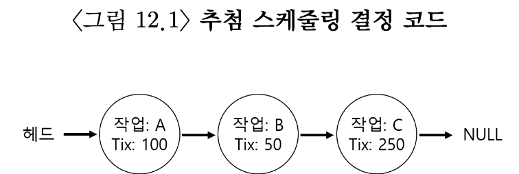
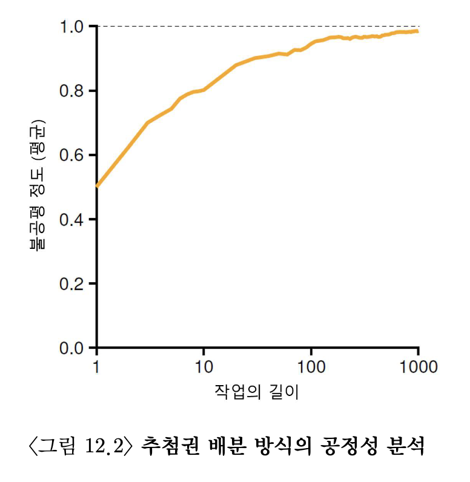

# 스케줄링 : 비례 배분
>비례 배분 : 반환 시간, 응답 시간 최소화하는 대신 스케줄라거 각 작업에게 CPU의 일정 비율을 보장. 

## 12.1 기본 개념 : 추첨권이 당신의 몫을 나타낸다.
> 추첨권(티켓) : 추첨 스케줄링의 근간! 프로세스가 받아야 할 자원의 몫. 

추첨 스케줄링은 추첨권에 비율에 따라 확률적으로 추첨값에 따라 프로세스가 결정됨. 

추첨권 스케줄링 : 무작위성  
장점  
1. 전통 방식이 해결하지 못하는 특이 상황 대응.
    * LRU 경우 반복되는 순차 접근 패턴에서 오버헤드 시 최악의 성능, 무작위는 해당 최악 경우 발생하지 않음.
    *  LUR란? Least Recently Used. 가장 오랫동안 참조되지 않은 페이지를 교체. 사용된지 가장 오래된 페이지는 앞으로 사용될 확률이 낮다는 가설에 만들어짐.
2. 무작위 추첨 방식이 매우 가벼움.
    * 공정 배분 스케줄링의 경우 각 프로세스가 사용한 cpu양 기록. 실행 마다 갱신. 반면 무작위의 경우 프로세스 상태 정보만 필요.
3. 무작위 추첨 방식은 매우 빠름.
    * 난수 발생 시간이 빠르면 결정 역시 빠름. 단, 속도 증가시 추첨 과정에서 덜 무작위하게 만듦.

## 12.2 추첨 기법
1. 추첨권 화폐(ticket curreny)
    * 추첨권을 화폐 가치로 추첨권을 자유롭게 할당.(추첨권 = cpu할달할 . 수있는 프로세스 몫.)
2. 추첨권 양도(ticket transfer)
    * 양도를 통해 프로세스가 일시적으로 다른 프로세스에게 넘겨줌.
    * 클라이언트/서버 환경에서 유용.
    * (1) 클라이언트 프로세스 -> 서버 작업 요청
    * (2) 작업 완료 시, 클라이언트는 서버에 추첨권 전달
    * (3) 서버는 요청 수행 동안 서버 성능 극대화.
    * (4) 요청 완수 시, 서버는 추첨권 클라이언트에게 되돌려줌.
3. 추첨권 팽창 (ticket inflation)
    * 프로세스 일시적으로 추첨권 수 늘이거나 줄이기 가능.
    * 신뢰하지 않은 프로세스간의 상호 경쟁 상황에서 의미 없음.
    * 욕심 많은 프로세스가 많은 양의 추첨권 자신에게 할당할 수 있음.
    * 해당 기법은 프로세스 간의 신뢰시 유용.

## 12.3 구현
난수 발생기와 프로세스들의 집합을 표현하는 자료구조, 추첨권의 전체 개수만 있으면 구현 가능 

1. 프로세스 리스트 순회, counter 값이 winner 값 초과할 때까지, 추첨권 개수를 count에 더함.
2. 값 초과시 리스트의 현재 원소가 당첨.
3. 당첨 번호가 300인 경우, a의 추첨권 개수가 더해져 counter 값 100증가.
4. 100 > 300, flause 반복문 실행.
5. counter 400 갱신 후 루프 탈출, current 프로세스 c가 당첨.  
리스트 내림차순 정렬시 해당 과정 가장 효율적, 단 정렬 순서는 알고리줌 정확성 영향 주지 않음. 

## 12.4 예제

1. 각 프로세스 같은 개수의 추첨권 가지고 있을 경우, 동일한 실행 시간 갖음.
2. 두 작업 동시 종료시, 추첨 스케줄링의 무작위성으로 한 작업이 먼저 종료 될 수 있음.
    * 불공정 지표
        > R = 10 (첫 번째 작업 종료 시간) 
        > U = 10/20 = 0.5 (첫 번째 작업 종료 시간 / 두 번째 작업 종료 시간)
3. 작업 길이가 길지 않은 경우 불공정 정도는 심각!

## 12.5 추첨권 배분 방식
작업들에게 추첨권을 몇 개씩 배분해야하는가?  
시스템 동작은 추첨권 할당 방식에 따라 크게 달라지기 때문에 배분은 어려운 문제.  
> 사용자가 가장 잘 알고 있다고 가정, 각 사용자가 추첨권을 나눠 준 후 사용자가 알아서 실행시키고자 하는 작업들에게 추첨권 배분.  
-> 해결책 아님, 추첨권 할당 문제는 아직 미해결 상태.

## 12.6 왜 결정론적 방법 사용하지 않는가?
무작위성 이용시 스케줄러 단순하게 만들수 있음. 단 정확한 비율 보장 못함. (짧은 기간 실행 경우 더 보장 못함.) 
-> 결정론적 공정 배분 스케줄러 "보폭 스케줄러(stride scheduling)"  

"보폭 스케줄러(stride scheduling)"  
* 시스템의 각 작업은 보폭을 갖음.
* 보폭은 추첨권 수에 반비례.
* 임의의 큰 값을 각자 추첨권 개수로 나누어 보폭 계산.
* 계산 된 값을 보폭, 프로세스 실행 마다 pass 값을 보폭 만큼 증가시켜 cpu 사용률 추적.
* 스케줄러는 보폭과 pass 사용해 프로세스 실행 결정.
* 가장 작은 pass 값 가진 프로세스 실행, 해당 프로세스 실행 마다 pass값을 포복만큼 증가.
* 보폭 스케줄링은 각 스케줄링 주기마다 정확한 비율로 cpu 배분.

> why? 보폭 스케줄링 정확도 고려 시 왜 추첨 스케줄링 사용? 
1.추첨 스케줄링의 경우 상태 정보가 필요 없음.  
2.새 프로세스 추가할 때, 프로세스가 가진 추첨권 개수와 전체 추점권 개수만 갱신 후 스케줄링.  
3.추첨 스케줄링은 쉽게 프로세스 추가.

## 12.7 요약

1. 추첨권 스케줄링
    * 무작위성.
    * cpu 스케줄러로 널리 사용 되지 않음.
    * 입출력과 맞물렸을 때, 제대로 동작 하지 않음.
    * 추첨권 할당의 문제

2. 보폭 스케줄링
    * 결정적 방법.
    * cpu 스케줄러로 널리 사용 되지 않음.
    * 입출력과 맞물렸을 때, 제대로 동작 하지 않음.
    * 추첨권 할당의 문제
