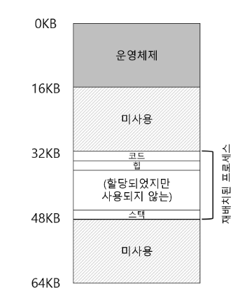

CPU 가상화 -> 제한적 직접 실행(LDE)
* 대부분 경우 프로그램은 하두웨어에서 직접 실행.
* 프로세스가 시스템 콜을 호출하거나 타이머 인터럽트가 발생 등 특정 경우 운영체제가 개입해 문제 발생 예방
* 하드웨어의 지원을 받아 효율적인 가상화 제공(프로그램 방해 되지 않게 해야함.)
> 메모리 가상화도 비슷한 전략을 갖음, 효율성, 제어 추구.
* 효율성 높이기 위해 하드웨어 지원 활용 할 수 밖에 없음.
* 제어는 프로그램이 자신의 메모리 이외의 다른 메모리를 접근하지 못하게 보호.
* 어떻게 유연성 있게 메모리를 가상화하지?
> 하드웨어 기반 주소 변환(hardware-based address trans-lation), 또는 주소 변환(address translation)
* 제한적 직접 실행 방식에 부가적으로 사용되는 기능.
* 하드웨어는 명령어 반입, 탑재, 저장 등 가상 주소 정보가 실제 존재하는 물리 주소로 변환.
* 하드웨어 제공되는 저수즌 기능들 변환 가속화 도움은 되지만, 하드웨어로만 가상화 구현 할 수 없음.
* 정확한 변환 위해서는 하드웨어 셋업 위한 운영체제 관여 필요. 운영체제는 메모리의 빈 공간과 사용 중인 공간을 알아야며, 메모리 사용 제어함.
* 프로그램이 전용 메모리 소유하고 있으며, 코드와 데이터가 있다는 환상을 만들어야함.
## 18.1 가정
사용자 주소 공간은 물리 메모리에 연속적으로 배치 되어 있다고 가정.
## 18.2 사례
```c
void func()
{
    int x;
    x = 3000;
    x = x + 3; // 우라가 관심 있는 코드
}
```
위 c 코드를 아래 어셈블리어 코드 변환.
```
128 : movl 0x0(\%ebx), \%eax    ; 0+ebx를 eax에 저장
132 : addl \ $0x03, \%eax       ; eax레지스터에 3을 더한다
135 : movl \ %eax, 0x0 (\%ebx)  ; eax를 메모리에 다시 저장
```
x 주소를 레지스터 ebx에 저장.
ebx에 저장되어 있는 값을 movl 명령어 사용해 범용 레지스터 eax에 넣기.
eax에 3을 더하고, eax의 값을 같은 위치 메모리에 저장.

* 주소 128의 명령어 반입
* 명령어 실행 (주소 15KB에 탑재)
* 주소 132의 명령어 반입
* 명령어 실행 (메모리 참조 없음)
* 주소 135의 명령어 반입
* 명령어 실행 (15KB에 저장)
프로그램 관점에서 주소 공간은 0부터 시작해 최대 16KB.
프로그램이 생성하는 모든 메모리 참조는 해당 범위 내에 있어야 함.
메모리 가상화를 위해 주소 0이 아닌 곳에 어떻게  프로세스 모르게 다른 위치로 위치 시킬까?

재배치 되었을 때의 그림.
## 18.3 동적(하드웨어-기반) 재배치
* 1950년 후반, 첫 번째 시분할 컴퓨터에서 베이스와 바운드 아이디어 채택
* 동적 재배치(dynamic relocation)라고도 불림.
* CPU 마다 2개의 하드웨어 레지스터 필요. 베이스 레지스터와 바운드 레지스터
* 베이스와 바운드는 쌍으로 사용자가 원하는 위치에 주소 공간을 배치.
* 배치 동시에 프로세스가 자신의 주소 공간에만 접근한다는 것 보장.
* 각 프로그램은 주소 0에 탑재되는 것처럼 작성되고 컴파일 됨.
* 운영체제가 프로그램 탐재될 물리 메모리 주소 결정하고 베이스 레지스터를 그 주소로 지정.
* 프로세스에 의해 생성되는 모든 주소가 다음과 같은 방법으로 변환.
```
physicall address = virtual address + base
```
* 프로세스가 생성하는 메모리 참조는 가상 주소.
* 하드웨어는 베이스 레지스터의 내용을 이 주소에 더해 물리 주소 생성.
```
128 : movl 0x0 (%EBX). % eax
```
1. 프로그램 카운터(pc)는 128로 설정.
2. 명령어를 반입할 때, pc값을 베이스 라에즈서의 값 32KB(32768) 더해 32896의 물리 주소 얻는다.
3. 해당 물리 주소에서 명령어 가져온다.
4. 프로세스는 명령어의 실행 시작.
5. 프로세스는 가상 주소 15KB의 값을 탑재하는 명령어 내림.
6. 해당 주소를 프로세스가 받아 베이스 레지스터(32KB) 더하고 물리주소 47KB 탑재.
> 주소 변환 : 가상 주소에서 물리 주소로의 변환. 하드웨어는 프로세스가 참조하는 가상주소를 받아들여 테이더가 실제로 존재하는 물리 주소로 변환. 주소 재배치는 실행 시에 일어나고, 실행 시작 후에도 주소 공간 가능하기에 동적 재배치라고도 불림.
* 바운드 레지스터는 어떻게 쓰지?
* 바운드 레지스터는 보호를 지원.
* 프로세스는 메모리 참조가 합법적인가를 확인하기 위해 가상 주소가 바운드 안에 있는지 확인.
* 프로세스가 바운드보다 큰 가상 주소 또는 음수인 가상 주소를 참조하면 CPU는 예외를 발생시키고, 프로세스 종료.
* 바운드 레지스터는 프로세스가 생성한 모든 주소가 합법적이고 프로세스의 범위에 있다는 것을 확인함.
* 베이스와 바운드는 CPU 칩에 존재하며, 주소 변환에 도움을 주는 프로세스의 일부를 메모리 관리 장치라고 불림.
* 바운드 레지스터 두 가지 정의
    * 주소 공간의 크기를 저장하는 방식, 가장 주소를 베이스 레지스터에 더하기 전에 바운드 레지스터와 비교
    * 주소 공간의 마지막 물리 주소를 저장하는 방식, 먼저 베이스 레지스터를 더해 결과가 바운드 안에 있는지 검사.
## 18.4 하드웨어 지원 : 요약
* 특권 모드(커널 모드) - 컴퓨터 전체의 접근 권한 가짐.
* 사용자 모드 - 응용 프로그램은 해당 모드에서 실행. 할 수 있는 일 제한.
* 하드웨어는 베이스와 바운드 레지스터를 자체적으로 제공
* cpu는 메모리 관리 장치의 일부인 추가의 레지스터를 쌍으로 갖음.
* 프로그램 실행 중이 ㄹ때, 하드웨어는 프로그램이 생성한 가상 주소에 베이스 값을 더해 주소를 변환.
* 하드웨어 주소가 유요한지 검사 할 수 있음.
* cpu는 사용자 프로그램이 바운드 벗어난 주소로 메로리 접근 시도시 예외 발생. -> 예외 핸들러 작동.
## 18.5 운영체제 이슈
>베이스와 바운드 방식의 가상 메모리 구현을 위한 운영체제 개입 되여야할 3가지 시점.
1. 프로세스가 생성될 때 운영체제는 주소 공간이 저장될 메모리 공간을 찾아 조치해야함.
    * 새로은 프로세스가 생성되면 운영체제는 새로운 주소 공간 할당에 필요안 영역을 찾기 위해 자료 구조 검색. 검색 후 선택된 공간을 사용중으로 표시
2. 프로세스 종료 시, 정상적으로 종료될 때 잘못된 행동을 하여 강제적으로 죽게될 때, 사용하던 메모리를 회수하여 다른 프로세스나 운영체제가 사용할 수 있게 해야함.
3. 운영체제 문맥 교환이 일어날 때
    * 각 프로그램들은 다른 물리 주소에 탑재 되어야기에 실행 중인 프로그램마다 다른 값을 갖는다.
    * 프로세스 전환 시 베이스와 바운드 쌍으로 저장하고 복원해야함.
    * 실행 중인 프로세스 중단시키기로 결정하면 메모리에 존재하는 프로세스 별 자료 구조 안에 베이스와 레지스터의 값을 저장. 프로세스 구조체, 프로세스 제어블럭을 저장.
    * 다시 시작 또는 처음 시작시 프로세스에 맞는 값으로 베이스 바운드 값 설정.
4. 운영체제는 예외 핸들러 또는 호출된 함수를 제공해야함.
    * 프로세스가 바운드 밖의 메모리 접근하는 경우 cpu는 예외 발생.
## 18.6 요약
* 주소 변환을 사용하면 운영체제는 프로세스의 모든 메모리 접근 권한을 제어할 수 있음. 접근이 항상 주소 공간의 범위 내에서 이루어짐.
* 베이스 레지스터를 가상 주소로 더하고, 바운드를 벗어나는지 검사하는 회로만 추가 하면 되기에 베이스 바운드 가상화는 효율적.
* 동적 재배치는 비효율적.  할당된 영역의 내부 공간이 사요오디지 않아 단편화가 발생(내부 단편화)
