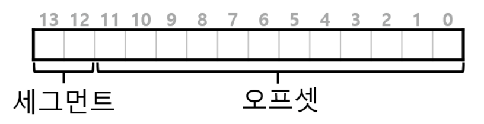
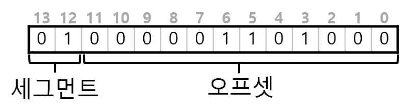
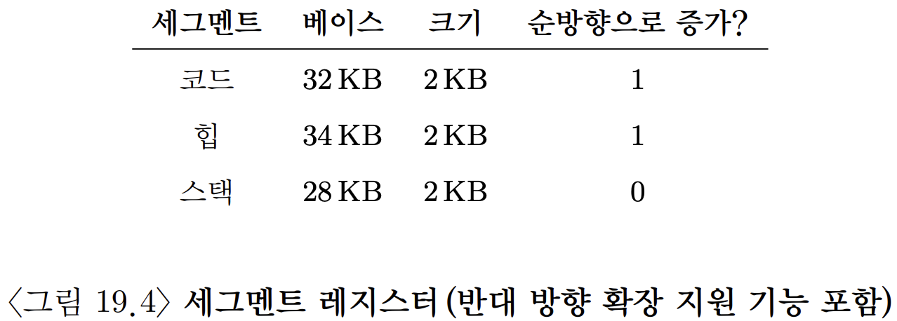
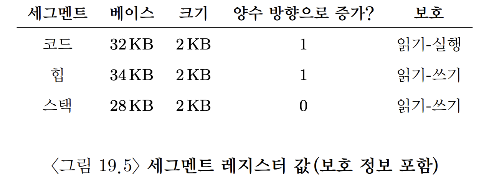
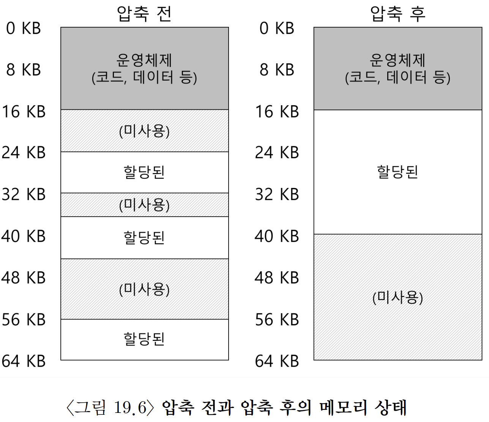

# 세그멘테이션
스텍과 힙 사이에 사용되지 않는 큰 공간이 존재한다는 사실을 알 수 있을 것이다.  
```
스텍과 힙 사이의 빈 영역이 존재하는 주소공간은 어떻게 지원할 것인가?
예시와는 달리 크기가 4GB인 32비트 주소공간을 상정한다면, 통상 프로그램은 단지 수 메가바이트만 사용함에도 불구하고 주소공간 전체가 메모리에 탑재되어야 한다. 
```
낭비를 어떻게 줄일것인가?

## 1. 세그멘테이션 : 베이스/바운드의 일반화
이 문제의 해결을 위해 탄생한 아이디어가 바로 `세그멘테이션(segmentation)`이다.

</br>

### 세그멘테이션
: MMU 안에 오직 하나의 베이스와 바운드 쌍만 존재하는 것이 아닌, 주소공간의 논리적인 `세그먼트(segment)`마다 베이스와 바운드 쌍이 존재한다. 
- 세그먼트 : 특정 길이를 가지는 연속적인 주소공간
- 우리가 기준으로 삼은 주소공간에는 코드, 스텍, 힙 세 종류의 세그먼트가 있다. 
- 세그멘테이션을 사용하면 운영체제는 각 세그먼트를 물리메모리의 각기 다른 위치에 배치할 수 있다.
  - -> 이를 통해 사용되지 않는 가상 주소공간이 물리 메모리를 차지하는 것을 방지할 수 있다.
- 아래 그림은 주소공간을 물리메모리에 배치하는 상황이다. 
  - 각 세그먼트의 베이스와 바운드 쌍을 이용하여 세그먼트들을 독립적으로 물리메모리에 배치할 수 있다. 

|가상주소공간|-> 세그멘테이션 적용한 물리메모리|
|-|-|
||
|
- 그림에서 볼 수 있듯, 사용중인 메모리에만 물리공간이 할당된다.
  - 사용되지 않은 영역이 많은 대형 주소공간(드문드문사용되는 주소공간; sparse address space)을 수용할 수 있다.
- 세그먼트 지원을 위한 MMU하드웨어 구조는 앞서 배운것과 같다.
  - 각 베이스 레지스터는 세그먼트의 위치를 저장한다.
  - 각 바운드 레지스터는 세그먼트의 크기를 저장한다.
  - 이후 계산은 앞서 배운 공식을 따른다.

- 만일 힙을 벗어난 7KB같은 잘못된 주소에 접근하려 한다면?
  - 하드웨어가 그 주소가 범위를 벗어났다는 것을 감지하고 운영체제에 트랩을 발생시키며 문제의 프로세스를 종료시킬 것이다.
    - 이것이 모든 C프로그래머들이 두려워하는 `세그먼트 위반(segment violation)` 또는 `세그먼트 폴트(sagment fault)` 이다.


## 2. 세그먼트 종류의 파악
하드웨으는 변환을 위해 세그먼트 레지스터를 사용한다.  
가상주소가 얼마나 세그먼트를 참조하는지, 세그먼트 안에서 오프셋은 얼마인지를 어떻게 아는가?

한 가지 일반적 접근법은, 가상주소의 최상위 몇 비트를 기준으로 주소공간을 여러 세그먼트로 나누는 것이다.  
(이 기법은 VAX/VMS시스템에서 사용되었다; VAX/VMS는 운영체제의 일종)

- 앞선 예에서 3 개의 세그먼트가 있다.
- 주소 공간을 세그먼트로 나누기 위해서는 2비트가 필요하다.(3까지 표현하려면 00 01 10이 될 수 있어야 함)
- 세그먼트를 표식하기 위해 14비트의 가상주소중 최상위 2비트를 사용하는 경우 가상주소의 모양은 다음과 같다.

- 최상위 2비트가 00이면, 하드웨어는 가상주소가 코드 세그먼트를 가리킨다는 말이다.
  - 따라서 코드 세그먼트의 베이스/바운드 를 이용하여 정확한 물리메모리에 재배치한다.
- 최상위 2비트가 01이면, 하드웨어는 가상주소가 힙 세그먼트라는 것을 인지한다.
- 예를 들어 가상 주소 4200에 해당하는 이진형식은 다음과 같다.  


</br>

세그먼트 종류 표현에 최상위 2비트를 사용하고 주소공간에 3개의 세그먼트가 존재하기에, 지정 가능한 세그먼트 하나는 미사용으로 남는다.  
즉, 전체 주소공간의 1/4은 사용이 불가능하다. 
- 이 문제를 해결하기 위해 일부 시스템은 코드와 힙을 하나의 세그멘트에 저장하고 세그멘트 선택을 위해 1비트만 사용한다.

</br>

특정주소의 세그먼트를 하드웨어적으로 파악하는 다른 방법들이 있다.  
`묵시적(implicit)` 접근 방식에서는 주소가 어떻게 형성되었는가를 통해 세그먼트를 결정한다. 
- 예를 들어 주소가 프로그램 카운터에서 생성되었다면 주소는 코드 세그먼트 내에 있을것이다.
- 주소가 스택 또는 베이스 포인터에 기반을 둔다면 주소는 스택 세그먼트 내에 있다.
- 다른 주소는 모두 힙에 있어아 한다. 


## 3. 스택_반대로 확장하는 녀석
반대로 확장하는 스택은 다른 방식의 변환이 필요하다.
- 간단한 하드웨어가 추가로 필요하다.
  - 베이스와 바운 뿐만 아니라 세그먼트가 어느 방향으로 확장하는지도 알아야 한다.
    - 예를 들어 커지는 쪽으로 확장하면 1, 작아지는 쪽으로 확장하면 0으로 설정할 수 있다.



## 4. 공유 지원
세그멘테이션 기법의 발전에 따라 간단한 하드웨어지원으로 새로운 종류의 효율성을 성취할 수 있게 되었다.  
메모리 절약을 위해 떄떄로 주소공간들 간의 특정 메모리 세그먼트를 공유하는 것이 유용하다.  
특히 코드 공유가 일반적이며 현재 시스템에서도 광범위하게 사용중이다.
- 공유의 지원을 위해 하드웨어에 `protection bit`의 추가가 필요하다.
  - 세그먼트마다 protection bit를 추가하여 세그먼트를 일고/쓰거나/실행시킬 수 있는지를 나타낸다.
  - 읽기 전용으로 설정 -> 주소공간의 독립성 유지 + 여러 프로세스가 주소공간 일부를 공유 가능
  - 각 프로세스는 여전히 자신의 전용메모리를 사용하고 있다고 생각하지만, 운영체제는 이 영역을 비밀리에 공유시켜 환상을 유지한다.
- 예시  
  
- protection bit를 사용하면 앞서 언급한 하드웨어 알고리즘이 수정되어야 한다.
  - 주소가 범위 내에 있는지 확인하기 + `특정 액세스가 허용되는지 확인하기`

</br>

## 5. 소단위 대 대단위 세그멘테이션
대단위(coarse-grained) 세그멘테이션  
: 지금까지는 소수의 세그먼트(코드, 힙, 스텍)만 지원하는 시스템에만 주로 초첨을 맞췄다.

소단위(fine-grained) 세그멘테이션  
: 일부 초기 시스템은 주소공간을 작은 크기의 공간으로 잘게 나누는 것이 허용되었다.

많은 수의 세그먼트 지원을 위해서는 여러 세그먼트의 정보를 저장할 `세그먼트 테이블`같은 하드웨어가 필요하다.  
예를 들어 Burroughs B5000같은 초창기 시스템은 수천 개의 세그먼트를 지원하였다.


## 6. 운영체제의 지원
이제 하나의 베이스-바운드 쌍을 사용하는 방식에 비해 세그먼트를 활용하는 것이 물리 메모리를 엄청나게 절약함을 알게 되었다.

그러나 세그멘테이션은 해결할 많은 문제를 제기한다.
1. 문맥 교환시 운영체제는 어떤 일을 해야 하는가?
   - 답 ->
     - 세그먼트 레지스터의 저장과 복원 : 각 프로세스는 자신의 가상 주소공간을 가지며 운영체제는 프로세스 재실행전 레지스터들을 올바르게 설정해야 함.
2. 미사용 중인 공간의 관리
   - 문제 구체화
     - 물리메모리가 빠르게 작은 크기의 빈공간으로 채워질 수 있다.
     - 이 작은 빈공간들은 새로운 세그먼트에 할당하기 힘들고 기존 세그먼트를 확장하는데에도 도움이 되지 않는다.
     - 위와 같은 문제를 `외부 단편화(external fragmentation)`이라 부른다.
   - 해결책
     - 기존의 세그먼트를 정리하여 물리메모리를 `압축(compact)`한다.
		
	- 압축의 한계
    	- 세그먼트 복사는 메모리에 부하가 큰 연산이며 상당량의 프로세스 시간을 사용하기에 압축비용이 많이 든다.
  	- 또다른 해결책_빈공간 리스트를 관리하는 알고리즘 사용하기
    	- 할당 가능한 메모리 영역들을 리스트 형태로 유지한다.
      	- 최적적합, 최악적합, 최초적합, 버디 알고리즘 등 고전적 알고리즘을 포함하여 수백 개의 방식이 존재한다.
      	- 좋은 알고리즘은 외부단편화를 가능한 줄이는 것이 목표이다.