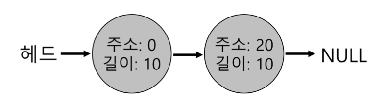
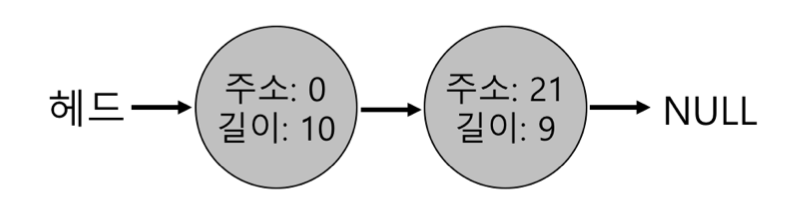
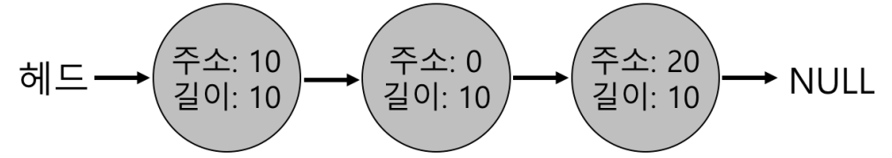

# 빈 공간 관리

모든 메모리 관리시스템의 근본적 측면을 논의해 보자.
\* 메모리 관리시스템 : 힙의 페이지 관리하는 malloc라이브러레, 프로세스 주소공간 일부 관리하는 운영체제 자체 등을 포함하는 개념  
</br>
구체적으로, `빈공간 관리`를 논의한다.

빈공간 관리가 쉬운 경우
- 관리하고 있는 공간이 고정크기 단위로 나누어져 있을 때 -> 고정크기 단위의 리스트 형식으로 관리하면 되기에 빈공간 관리가 쉽다.  

빈공간 관리가 어려운 경우
- 관리하는 공간이 가변-크기 빈공간으로 이뤄져있는 경우
  - malloc + free처럼 사용자수준 메모리 할당 라이브러리에서 발생
  - 세그멘테이션으로 물리메모리를 관리하는 운영체제에서 발생
- 빈공간은 다양한 크기의 작은 조각으로 분할 -> 외부단편화
    - 빈공간의 총합 크기가 크더라도 하나의 연속된 영역이 존재하지 않는다면 요청이 실패할 수 있음.  
</br>


```c
"빈공간의 총합 크기가 크더라도 하나의 연속된 영역이 존재하지 않는다면 요청이 실패할 수 있음."
-> 이 장에서 해결하고자하는 문제!
```

## 1. 가정
- malloc()과 free()에서 제공하는 것과 같은 기본 인터페이스를 가정.
  - 이 라이브러리가 관리하는 공간은 "힙"
  - 힙의 빈 공간을 관리하는데 링크드리스트가 사용됨(필수는 아님).
- 외부 단편화 방지에 특히 중점을 둘 예정.
  - 내부 단편화 문제도 있을 수 있다.
    - 할당기가 요청한 크기보다 더 큰 메모리청크를 할당할 경우 내부 낭비가 일어나는 경우.
  - "논의 단순화 + 외부단편화 문제가 더 흥미로움" 때문에 외부단편화에 초첨 맞춘다
- 클라이언트에게 할당된 메모리는 다른 곳으로 재배치가 불가능하다고 가정.
  - malloc()으로 일부영역에 대한 포인터 받을시, 그에 대응하는 free()를 통해 반환될 때 까지 프로그램이 소유하며 다른 위치로 옮겨지지 않을것.
  - (단편화 해결에 유용히 사용되는) 빈 공간의 압축은 이번엔 사용불가.
    - 운영체제가 세그멘트를 구현시, 단편화를 해결하기 위해 압축을 사용할 수 있음.
</br>
</br>

## 2. 저수준 기법들
대부분의 할당기에서 사용되는 일반적 기법
   
### 1. 분할과 병합


#### 분할 

30바이트의 힙이 있다.  
힙의 빈 공간에는 2개의 원소가 있다.  
하나는 0-9의 빈 세그먼트 / 다른 하나는 20-29의 빈 세그먼트  


- 10바이트를 초과하는 모든 요청  
	- 요청한 크기의 메모리 청크가 없기 때문에 실패하여 NULL을 반환할 것이다.
- 10바이트에 대한 요청  
	- 둘중 하나의 빈 청크를 사용하여 쉽게 충족된다. 
- 10바이트보다 적은 요청 > 1바이트만 요청했다 가정  
   - 이 경우 할당기는 분할(splitting)을 수행.
		1. 요청을 만족시킬 수 있는 빈 청크를 찾아 이를 둘로 분할
		2. 첫 번째 청크는 호출자에게 반환 , 두 번째 청크는 리스트에 남는다.  
		- 즉 할당기가, 리스트의 두 번쨰 (빈)원소를 사용하기로 가정하면, malloc은 20을 반환하고 최종 빈 리스트는 아래와 같이 된다.
  		

결론 : 요청이 특정 빈 청크의 크기보다 적은 경우 분할기법을 사용한다.  

#### 병합
분할에 당연히 동반되는 기법은 빈공간의 병합(coalescing)이다.  
응용프로그램이 free(10)을 호출하여 힙 중간의 공간을 반환할 경우 아래와 같은 모양이 된다.

발생하는 문제
- 사용자가 20바이트를 요청한 경우 단순 리스트 검색은 빈 청크를 발견하지 못하고 실패를 반환한다.  

문제해결
- 메모리 청크가 반환될 때 빈 공간들을 병합하기.
  - 해제되는 청크의 주소와 바로 인접한 빈 청크의 주소를 살펴본다.
  - 바로 인접했다면 하나로 병합한다.
- 위의 예시는 "주소 : 0 / 길이 : 30"인 하나의 리스트가 된다.

</br>
</br>
### 할당된 공간의 크기 파악
free()인터페이스는 크기를 매개변수로 받지 않는다.  
포인터가 인자로 전달되면 malloc라이브러리는 해제될 메모리 크기를 신속히 파악하여 빈공간 리스트에 추가시키도록 한다.  

이 작업을 위해 대부분의 할당기는 추가 정보를 헤더블럭에 저장한다.
1. 헤더블럭은 보통 해제된 청크 바로 직전에 위치한다.
2. 사용자가 free(ptr)을 호출하면 라이브러리는 헤더 시작 위치 파악을 위해 간단한 포인터 연산을 한다. 
3. 헤더를 가리키는 포인터를 얻어내면 라이브러리는 안전성 검사(sanity check)를 실시한다.
4. 새로 해제된 영역의 크기를 간단한 수학을 통해 계산한다.

주의할 점.
- 빈 영역의 크기는 "헤더크기 + 할당된 영역의 크기"가 된다.
  - 사용자가 n바이트 메모리청크 요청시 라이브러리는 "n크기의 빈 청크"를 찾는게 아닌 "빈청크 크기 n + 헤더크기"인 청크를 탐색한다.

### 빈 공간 리스트 내장 
리스트를 빈공간에 구현하는 방법  

```c
typedef struct __node_t {
int 				size;
struct __node_t	*next;
} node_t;
```

- 4096바이트 메모리 청크가 있다고 가정
- 빈 공간 리스트로 관리하기 위해 먼저 리스트를 초기화한다(위 리스트노드)
- 힙은 초기화하고 빈 공간 리스트의 첫 번째 원소를 넣는다.
  - 힙은 시스템콜 mmap()을 호출하여 얻어진 영역에 구축한다.
	```c
	// mmap()ᯕ 빈 공간의 청크에 대한 포인터를 변환
	node_t *head = mmap(NULL, 4096, PROT_READ|PROT_WRITE,
	MAP_ANON|MAP_PRIVATE, −1, 0);
	head−>size = 4096 − sizeof(node_t);
	head−>next = NULL;
	```
- 이 코드를 실행후 리스트는 크기 4088항목 하나만 가진다.
- 헤드 포인터는 이 영역의 시작주소를 가지고 있다.
- 영역의 시작 주소는 16KB로 가정한다.  
</br>
(중략)  
</br>
뭐가 너무 많은데 그냥 요약하자면, 청크와 함께 헤더메모리가 따라오며, 이를 계산해서 할당해제 및 분할 + 병합을 해야한다는 말임.

### 힙의 확장
힙 공간이 부족한 경우  
->가장 쉬운 방법은 실패(NULL)를 반환하는 것(때로는 이 방법이 유일한 대안임)  

1. 대부분의 전통적 할당기는 적은 크기의 힙으로 시작하여 모두 소진시 운영체제로부터 더 많은 메모리를 요청한다.  
2. 할당기는 힙을 확장하기 위해 특정 시스템 콜(sbrk)을 호출한다. 
	- sbrk 요청 수행을 위해 운영체제는 빈 물리페이지를 찾아 요청프로세스의 주소공간에 매핑 후 새로운 힙의 마지막 주소를 반환핟다.
3. 확장된 영역에서 새로운 청크를 할닿안다.


## 3. 기본 전력
기본 전략은 간단하다. 이상적인 할당기는 속도가 빠르고 단편화를 최소화해야한다.  
그러나, 할당 및 해제는 프로그래머의 영역이므로 잘 맞지 않은 입력을 만나면 성능이 나빠진다.  
그러므로 최선의 전략이 아닌 기본 정책과 장단점을 논한다.

### 최적 적합(Best Fit)
: 빈공간 리스트를 검색하여 요청한 크기 이상의 메모리 청크 찾기  
그 중 가장 작은 크기의 청크를 반환하기.  
- 단점
  - 해당 빈 블럭을 찾기 위해 항상 전체검색을 해야하기 때문에 엄청난 성능저하를 초래한다.

### 최악 적합(Worst Fit)
: 가장 큰 빈 청크를 찾아 요청된 크기만큼만 반환하고 남은 부분은 빈공간 리스트에 계속 유지.
- 단점
  - 이 방식 역시 높은 비용을 지불
  - 대부분 엄청난 단편화가 발생하며 오버헤드도 큼

### 최소 적합 (First Fit)
: 요청된 크기 이상인 첫 번째 블럭을 찾아 요청만큼 반환한다.
- 장점
  - 속도가 빠르다. 
- 단점
  - 리스트의 시작에 크기가 작은 객체가 많이 생길 수 있다.
  - 따라서 할당기가 빈 공간 리스트의 순서를 관리하는 방법이 쟁점!
    - 주소-기반 정렬을 사용하면 "병합 수월 + 단편화 감소" 가능

### 다음 적합 (Next Fit)
: 마지막으로 찾았던 원소를 가리키는 추가포인터를 만들고 유지한다. 이는 빈공간 탐색을 리스트 전체에 더 균등히 분산시킨다.
- 장점
  - 리스트의 첫 부분에만 단편이 집중적으로 발생하는 것을 방지한다.
  - 전체탐색을 하지 않으므로 최초적합의 성능과 비슷하다.


## 4. 다른 접근법

### 개별리스트 (segregated list)
: 특정 응용프로그램이 한두개 자주 요청하는 크기가 있다면 그 크기의 객체를 관리하기 위한 별도 리스트를 유지하기.
- 장점
  - 특정 크기요청을 위한 메모리 청크를 유지하므로써 단편화 가능성을 많이 줄일 수 있다.
  - 요청된 크기의 청크만 존재하기 때문에 복잡한 리스트 검색이 필요하지 않으므로 할당 해제를 신속히 처리할 수 있다.
- 해결할 문제
  -  지정된 크기의 메모리풀과 일반적인 풀에 얼만큼의 메모리를 할당하는가?
     -  특수목적 할당기인 슬랩할당기(slab allocator)를 통해 해결

### 버디 할당
: 빈 공간의 합병은 할당기의 중요한 기능 
그래서 합병을 간단히 하는 방법이 설계되었다.  
이진 버디 할당기(binary buddy allocator)가 좋은 예이다.

빈 메모리는 처음에 2^n인 하나의 큰 공간으로 여긴다.
메모리 요청이 발생하면 요청을 충족시키기 충분할 때 까지 2로 나누며 분할한다.  
64KB의 빈 공간에서 7KB 블럭을 할당하는 예가 있다.
- 장점
  - 블럭이 해제될 때 재귀합병을 통해 전체 빈공간 복원이 수월하다.
  - 특정 블럭의 버디 결정이 쉽기 때문에 버디 할당이 잘 작동한다.
- 단점
  - 2의 거듭제곱 크기만큼의 블럭만 할당할 수 있기에 내부단편화가 발생하기 쉽다.

### 기타 아이디어
앞서 접근 방식들은 확자성이 문제였다.
빈공간의 개수가 늘어나면서 리스트 검색이 매우 느려질 수 있다.  

좀 더 정교한 할당기는 복잡한 자료구조를 사용하여 이 비용을 줄인다. 
단순함과 성능을 교환한다.  
ex_균형이진트리, 스플레이트리, 부분정렬트리 등  

