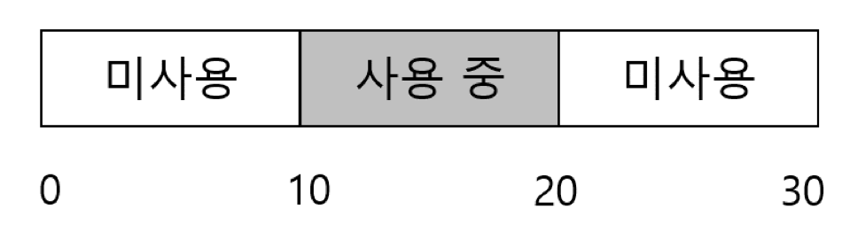
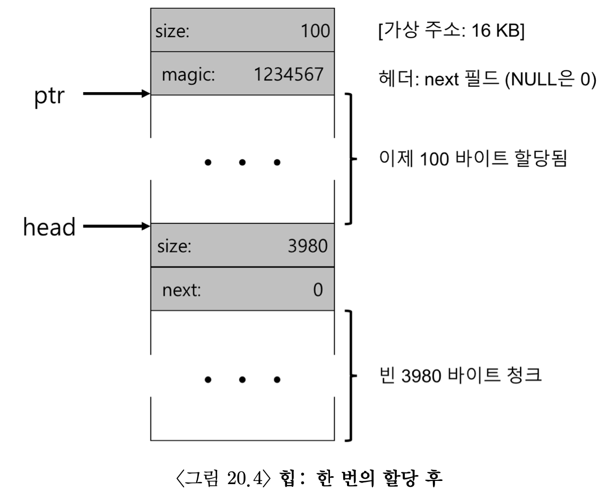
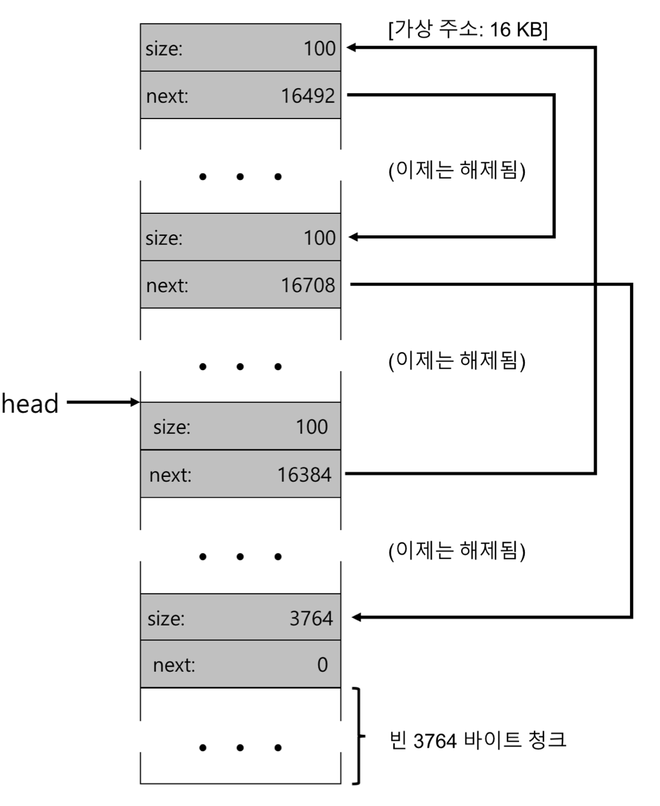

# 빈 공간 관리

  

현재 메모리의 남는 공간은 20바이트이다. 하지만 메모리에 15바이트 짜리 할당을 클라이언트가 요청을 했다고  
가정을 하자, 이렇게 되면 연속된 15바이트의 공간이 없기때문에 할당을 하지못하게 된다.  
이러한 문제를 해결한 방법을 생각을 해보자!!!!  
빈공간을 어떻게 관리 할까???  

## 가정
클라이언트에게 할당된 메모리는 다른 위치로 재배치될 수 없다고 가정한다.  
압축은 사용 불가능 하다.  (이장에서 우리가 가정한 내용이다.)

## 저수준 기법들

  

</br>

*  분할과 병합  
빈공간 리스트에 30 바이트의 힙이 있다고 가정  
  
이때 10 바이트를 초과하는 메모리 할당 요청은 모두 실패 But 1바이트를 요청한다면???  
분할  
  
요청을 만족시킬수 있는 청크를 찾아서 분할하고 첫번째 청크는 반환 하고,  
두번째 청크는 리스트에 남게 된다.  최종 리스트는 그림과 같이 만들어 진다.  
병합  
  
중간부분을 free(10)을 해준 경우를 생각 해보자 그렇게 되면 그림과 같이 리스트는 새개의 청크로 나누어진다.  
이때 만약 20바이트의 할당을 요청한다면??? 당연히 연속된 청크가 없기때문에 실패한다.  
이런경우 해결방안은 빈청크에 바로인접한 빈청크가 있다면 병합을 해주고 30바이트의 리스트가 생성된다.  

### 할당된 공간의 크기 파악
우리는 free를 해줄때 할당된 크기를 전해주지 않는다. 하지만 free는 기특하게도 우리가 할당한 만큼 해제를  
시켜준다. 이건 어떻게 되는걸까????  
메모리를 할당을 하는 과정에서 추가 정보를 헤더블럭에 저장한다. 이블록은 보통 헤제되는 청크  
직전에 저장된다.  
이정보는 뭐가 저장되어 있을까??? 
```c

typedef struct {
	int size;
	int magic;
} header_t;

```
메모리 할당되는 크기 그리고 확인을 위한 매직넘버가 저장되어 있다.  
free(ptr)을 하는순간
```c

void free(void *ptr){
	header_t *hptr = (header_t *) ptr - 1;
}

```
이계산이되고 hptr(헤더 청크의 포인터)의주소를 찾게 된다. 이과정을 거친후 할당된크기 N + 헤더청크의 크기  
를 계산한다.  
그리고 안정선 검사를 실시한다.(매직 넘버가 기대하는 값과 일치하는지 비교하는 과정)  

### 빈 공간 리스트 내장
4096바이트 크기의 메모리 청크가 있다고 가정하자 빈공간 리스트로 관리하기 위해서는 먼저 리스트를 초기화  
해줘야함 초기화 정보로는 사이즈와 다음 리스트의 주소가 들어 가있음.  초기화하면 헤더를 제외한 메모리  
크기 4088이 할당이 되어있음  
```c

typedef struct __node_t{
	int size;
	struct __node_t *next;
}

```
100바이트 할당 요청되면 4088에서 헤더블럭을 제외한 108이 할당이되고 3980이 남게된다.  
  

다음의 경우를 보자 만약 100 씩 3개가 할당되었는데 free가 된경우라면 리스트들은 어떻게 바라볼까??
  
해제된 청크들의 다음 주소들을 바라보게 된다.  
이렇게 된경우 외부 단편화의 문제가 발생하게 되는데, 청크를 병합을 하면 문제가 해결된다.

## 기본 전략

빈공간을 효율적으로 할당하기 위한 기법을 알아보자
1. 최적 적합 -> 리스트에서 요청한 크기와 같거나 더큰 매모리 청크를 찾고 그중에 가장 작은 메모리 청크를  
반환 한다. 많은 비용을 수반한다. 전부검색해야 되서  
2. 최악 적합 -> 가장큰 청크를 찾는다. 이것 또한 전체를 찾아야 하기 때문에 비용이 많이 든다.  
3. 최초적합 -> 요청한 보다 큰 첫번째 블록을 찾아서 반환한다.  
4. 다음 적합 -> 마지막으로 찾았던 원소를 가르키는 추가 포인터를 유지한다.  
5. 버디 할당 -> 2진기법으로 나누어서 메모리를 할당한다. 메모리 크기가 2진법의크기로 할당이 되어서 버리는  
메모리 크기가 발생 할 수있다. 