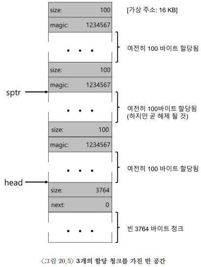

# 20 빈 공간 관리
빈 공간은 어떻게 관리하는가?

## 20.1 가정
힙의 빈 공간을 표현할 수 있는 자료구조를 살펴보고 외부단편화 방지를 중심으로 살펴보기. <br>
클라이언트에게 할당된 메모리는 다른 위치로 재배치될 수 없다고 가정.

## 20.2 저수준 기법들
1. 분할 <br>
	10바이트의 빈 세그멘트가 빈공간 리스트가 있다고 가정할 때 10바이트보다 작은, 예를 들면 1바이트의 메모리를 요청했다고 가정. <br>
	1바이트를 할당할 수 있는 빈 청크를 찾아 둘로 분할함. 첫 번째 청크는 호출자에게 반환되고, 두 번째 청크는 리스트에 남게됨
2. 병합 <br>
	길이가 10인 빈 세그먼트 세 개가 빈공간 리스트에 있다고 가정할 때, 30 바이트의 메모리를 요청했다고 가정. <br>
	세 개의 빈 세그먼트를 합쳐서 길이가 30인 세그먼트 하나로 만든 후 호출자에게 반환.

<strong>할당된 공간의 크기 파악</strong> <br>
8바이트의 헤더 블럭에 청크에 대한 size, magic정보를 저장하고, 바로 뒤 ptr의 주소값을 호출자에게 반환함

```c
typedef struct _ _header_t {
int size;
int magic;
} header_t;
```

따라서, free를 호출할 경우 라이브러리는 헤더의 시작 위치를 파악하기 위해 간단한 포인터 연산을 함.
```c
void free(void *ptr) {
header_t *hptr = (void *)ptr − sizeof(header_t);
...
```
<strong>빈 공간 리스트 내장</strong> <br>

위와 같이 100바이트를 할당한 세 개의 청크가 있고, 하나의 빈 청크가 있으며, 가운데 청크를 free할 경우 라이브러리가 신속히 빈 공간을 파악하여 빈 공간 리스트에 빈 청크를 삽입한다. <br>
리스트를 순회하며 인접한 청크를 병합하면 하나의 큰 빈 청크를 만들 수 있음.

<strong>힙의 확장</strong><br>
힙 공간이 부족한 경우: NULL 반환

### 20.3 기본 전략
1. 최적 적합 <br>
	빈공간 리스트를 검색하여 요청한 크기와 같거나 더 큰 빈 메모리 청크 중 가장 작은 크기의 청크 반환.
2. 최악 적합 <br>
	빈공간 리스트를 검색하여 요청한 크기와 같거나 더 큰 빈 메모리 청크 중 가장 큰 크기의 청크 반환. <br>
->하지만 이들은 전체 리스트를 탐색함
3. 최초 적합 <br>
	요청보다 더 큰 첫 번째 블럭을 찾아서 요청만큼 반환
4. 다음 적합 <br>
	마지막으로 찾았던 원소를 가리키는 추가의 포인터를 유지.

## 20.4 다른 접근법
1. 개별 리스트 <br>
	특정 응용 프로그램이 한 두개 자주 요청하는 크기가 있다면 그 크기의 객체를 관리하기 위한 별도의 리스트 유지
2. 슬랩 할당기 <br>
	커널이 부팅될 때 커널 객체를 위한 지정된 크기의 객체들로 구성된 빈 공간 리스트인 여러 객체 캐시를 할당함. 기존에 할당된 캐시 공간이 부족하면 페이지 크기의 정수배인 상위 메모리 할당기에게 추가 슬랩을 요청함.
3. 버디 할당
	2의 n제곱인 하나의 큰 공간의 빈메모리를 가지고, 메모리 요청이 발생하면 충분한 공간이 발견될 때까지 빈 공간을 계속 2개로 분할함.