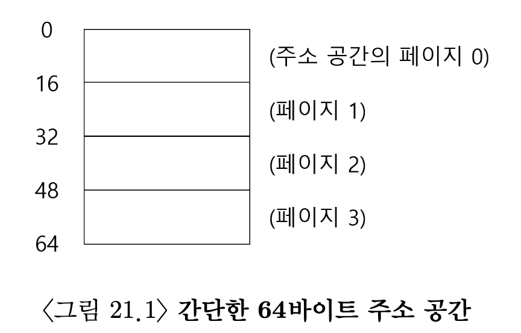
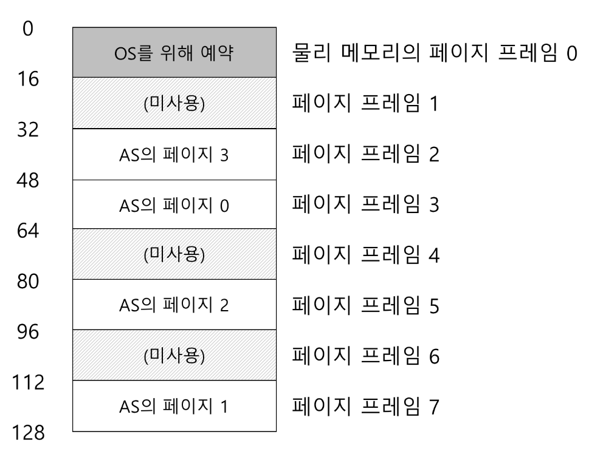
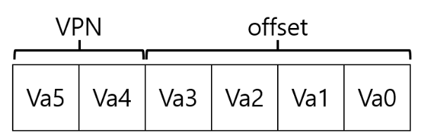
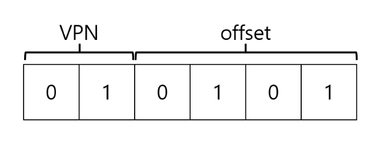
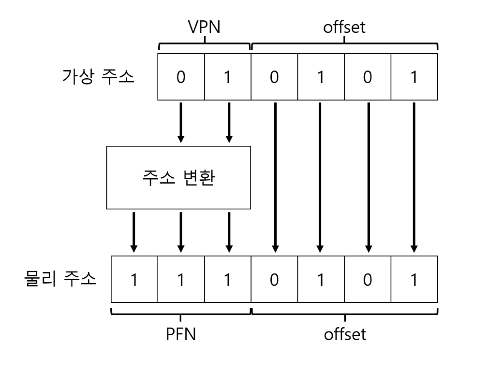
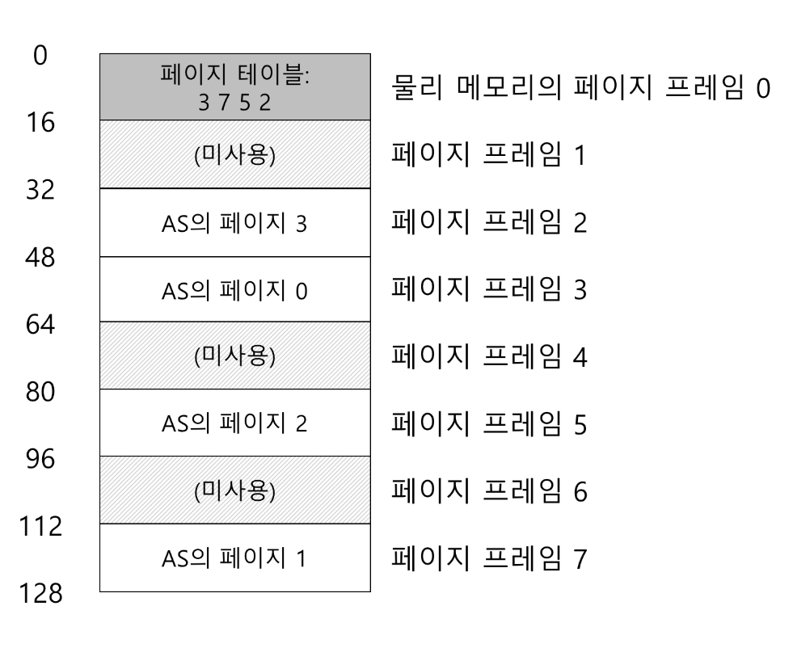
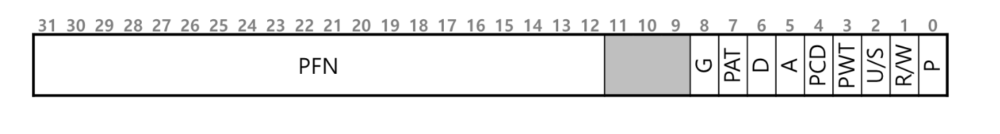
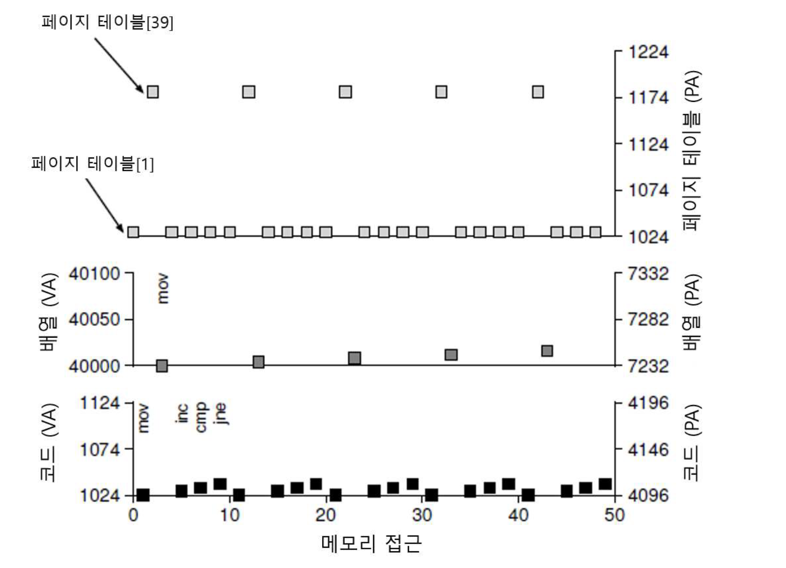

# 페이징 개요
운영체제가 공간관리 문제를 해결할 때 사용하는 두 가지 방법
1. 가변크기 조각들로 분할하기
   - 공간을 다양한 크기의 청크로 분할할 때 공간 자체가 단편화 될 수 있음.
2. 공간을 동일한 크기의 조각들로 분할하기
   - 이것이 페이징

각각의 고정크기로 나는 것을 페이지 
## 1. 간단한 예제 및 개요

아래는 총 크기가 64바이트이면서 4 개의 16바이트 페이지로 구성된 작은 주소공간의 예시  
  
(여기서 64바이트라는건 데이터의 크기, 비트는 주소공간의 크기를 결정하는 단위임!)

  


- 가상 주소공간의 페이지들은 물리 메모리 전체에 분산배치됨.
- 또한 운영체제가 자기 자신을 위해 물리메모리의 일부를 사용하는 것도 보여줌.


페이징의 가장 중요한 점은 유연성!
- 페이징을 사용하면 프로세스의 주소공간 사용방식과 상관없이 효율적으로 주소공간 개념을 지원 가능.
- 또다른 장점은 페이징이 제공하는 빈공간 관리의 다양성.
-  주소 공간의 각 가상페이지에 대한 물리메모리 위치 기록을 위해 프로세스마다 페이지테이블이라는 자료구조를 유지한다.
   -  페이지 테이블 : 주요 공간의 가상 페이지 주소변환정보를 저장하는 것  
</br>
- 페이지 테이블은 프로세스마다 존재한다는 사실
  - 대부분의 페이지 테이블 구조는 프로세스마다 존재함.
  - 그러므로, 다른 프로세스를 실행해야 한다면 이 프로세스를 위한 페이지 테이블이 따로 필요하다는 말임.
</br>
</br>

  
프로세스가 생성한 가상 주소의 변환을 위해 먼저 가상 주소를 가상 페이지 번호(VPN)와 페이지 내 오프셋 2개의 구성요소로 분할
</br>

- 상위2비트는 가상페이지 번호
- 나머지 비트는 페이지 내의 우리가 원하는 바이트의 위치를 나타냄 (== 오프셋)


- 예시
  
위 그림은 탑재 명령어의 가상 주소가 21  
이를 이진형식으로 변환하면 010101  
</br>
  
VPN을 물리 프레임 번호(PFN)으로 교체하여 변환 가능  
최종적으로 계산된 물리주소는 1110101이며 이곳이 탑재할 데이터가 저장된 정확한 위치.


## 2. 페이지 테이블은 어디에 저장되는가
페이지 테이블은 매우 큼  
그러므로 현재 실행중인 프로세르의 페이지 테이블을 저장할 수 있는 회로를 MMU안에 유지하이 않을 것임.  
대신 각 프로세스의 페이지 테이블을 메모리에 저장.  
</br>
당분간 페이지 테이블은 운영체제가 관리하는 물리메모리에 상주한다고 가정할 것
(나중에 운영체제 메모리 자체의 많은 부분이 가상화될 수 있음을 공부할 것임)


## 3. 페이지 테이블에는 실제 무엇이 있는가
페이지 테이블의 구성
- 가장 간단한 현태는 선형 페이지 테이블
  - 단순한 배열
  - 원하는 물리프레임 번호를 찾기 위해 배열 항목에 접근하고 페이지 테이블 항목(PTE)을 검색.
  

- 각 PTE에는 심도있는 이해가 필요한 비트들이 존재
    
  - Valid bit
    - 특정 변환의 유효 여부를 나타내기 위함.
    - 모든 미사용 공간은 무효로 표시
    - 프로세스가 그런 메모리에 접근하려 하면 운영체제에 트랩을 발생시킴
  - Protection bit
    - 이 비트가 허용하지 않는 방식으로 페이지에 접근하려 하면 트랩을 생성함
  - Present bit
    - 페이지가 물리메머리에 있는지 디스크에 있는지(즉, 스왑아웃 되었는지)를 가리킴
  - dirty bit
    - 메모리에 반입된 이후 페이지가 변경되었는지 여부를 나타냄
  - reference bit
    - 페이지가 접근되었는지 추적하는 비트
    - 어떤 페이지가 인기가 있었는지 결정하는데 사용하기도 함


## 4. 페이징 : 너무 느림
페이지 테이블의 크기가 메모리 상에서 매우 크게 증가할 수 있으며, 페이지 테이블로 인해 처리 속도가 저하될 수 있음.  

- 각 메모리 참조시 일어나는 세부동작을 살펴보면, 모든 메모리 참조에 대해 먼저 페이지 테이블에서 변환 정보를 반입해야 하기에 반드시 한 번의 추가적인 메모리 참조가 필요함.
  - 이는 엄청난 양의 작업임
  - 때문에 메모리 참조는 비용이 비싸고 프로세스는 2배 이상 느려짐.
- 해결해야 할 문제
  - 하드웨어와 소프트웨어의 신중한 설계가 없다면 페이지 테이블로 인해 시스템이 매우 느려질 수 있음 + 너무 많은 메모리를 차지함.

## 5. 메모리 트레이스

간단한 메모리 액세스 예시를 통해, 페이징을 사용했을 때 발생하는 모든 메모리 접근을 살퍄 본다.
```c
int arr[1000];
...
for (i = 0; 1 < 1000; i++)
	array[i] = 0;
```

- 처음 다섯 번의 루프 반복에 대한 전체 과정이 아래 그림
    
	- 이 그래프는 페이지 테이블 (물리적)메모리 접근
	- 루프당 10번의 메모리 접근이 존재.
    	- 네 번의 명령어 반입
    	- 한 번의 메모리 갱ㅇ신
    	- 이를 위한 주소변환을 위한 총 다섯 번의 페이지 테이블 접근

간단한 예시로 실제 응용프로그램의 메모리 동작이 얼마나 복잡한지 알 수 있음.