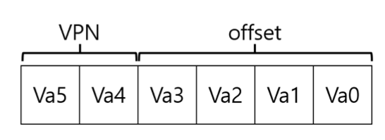
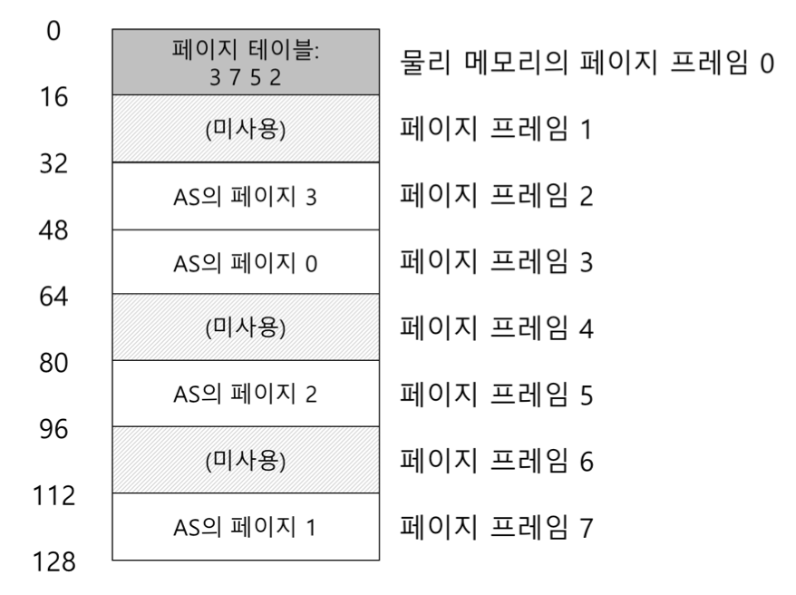
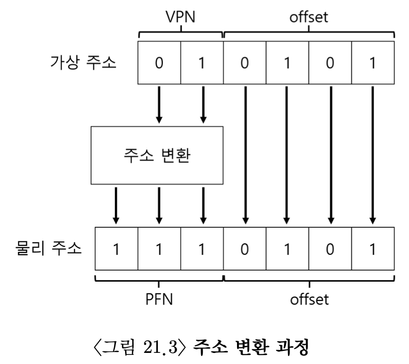
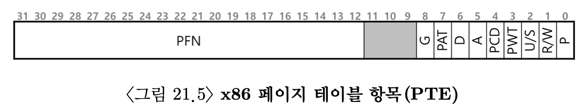
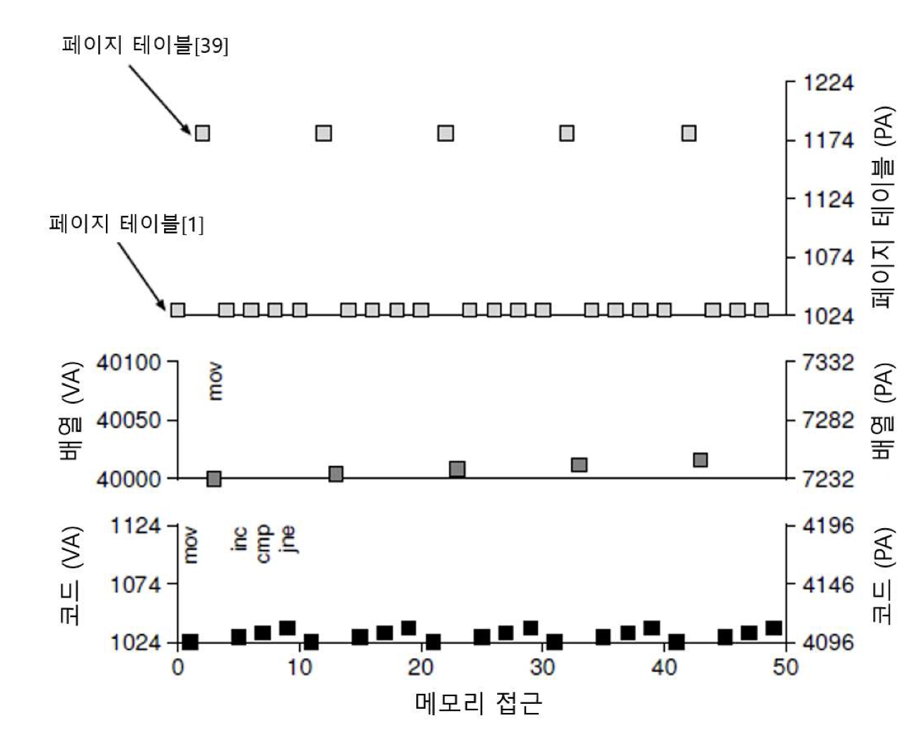

# 페이징: 개요

OS의 공간관리 문제<br>
1. 가변크기로 분할(단점: 단편화)
2. page단위(메모리를 관리하는 기본 단위)의 동일 크기로 페이징. 물리 메모리를 고정 크기의 슬롯의 배열인 page frame이라 생각한다.

페이지를 사용하여 어떻게 메모리를 가상화할 수 잇을까?

## 21.1 간단한 예제 및 개요
paging의 장점 <br>
1. 유연성
	- 힙과 스택의 방향성 등을 상관하지 않아도 됨
2. 빈 공간 관리의 단순함

page table 자료구조 <br>
- 주소 공간의 각 가상 페이지에 대한 물리 메모리 위치 기록을 위해 사용
- 주소 공간의 가상 페이지 주소 변환 정보 저장
- 각 페이지가 저장된 물리 메모리의 위치가 어디인지 알려줌
- 프로세스마다 존재

```c
movl <virtual address>, %eax
// virtual address의 데이터를 eax 레지스터에 탑재
```
가상 주소의 변환을 위해 가상주소를 가상 페이지 번호 (virtual page nuber, VPN)과 오프셋으로 분할 한다. <br>



-> 가상 주소 공간의 크기가 64바이트인 경우 가상 주소는 2의 6제곱이기에 6비트가 필요함(주소를 표현하기 위해 필요한 비트 수는 주소 공간 크기의 2의 제곱으로 결정). <br>

프로세스가 가상주소를 생성하면 운영체제와 하드웨어는 의미있는 물리 주소로 변환. <br>

ex)
```c
movl 21, %eax
// 가상주소가 21
// 21은 binary로 010101임
```


-> 1페이지에 있고, 페이지 내 5번째 바이트에 있다. <br>



-> 물리 페이지 번호(physical page number, PPN == 물리 프레임 번호(physical frame number, PFN))는 7이므로 다음과 같이 변환됨. 그 후 물리 메모리에 탑재 후 명령어 실행.

## 21.2 page table은 어디에 저장되는가?
가상 메모리에 저장할 수 있으며 디스크에 스왑될 수 있음.

## 페이지 테이블에는 실제 무엇이 있는가
page table: 가상 주소(가상 테이블 번호)를 물리 주소(물리 프레임 번호)로 매핑하는데 사용되는 자료구조 <br>

선형 페이지 테이블(linear page table): 단순한 배열 <br>
OS는 PFN을 찾기 위해 VPN으로 배열의 항목에 접근하고 그 항목의 페이지 테이블 항목(page table entry, PTE)를 검색한다. <br>

PTE에 존재하는 비트 <br>
1. Valid Bit
	- 특정 변환의 유효 여부를 나타냄.
	- ex) 프로세스가 힙과 스택의 사이에 있는 미사용공간에 접근하려면 OS에 트랩 발생.
	- 할당되지 않은 주소공간을 표현하기 위해 반드시 필요
2. Protection Bit
	- page가 읽을 수 있는지, 쓸 수 있는지, 실행될 수 있는지 표시
	- 허용하지 않은 방식으로 page에 접근하려면 OS에 트랩 생성
3. Present Bit
	- page가 메모리에 있는지 디스크에 있는지(= 스왑아웃되었는지) 가리킴
4. Dirty Bit
	- 메모리에 반입된 후 page가 변경되었는지 여부
5. Reference Bit(=accessed bit)
	- page가 접근되었는지 추적
	- 어떤 페이지가 인기있는지 결정하여 메모리에 유지되어야 하는 page 결정



## 21.4 페이징: 너무 느림
page table의 크기가 메모리 상에서 매우 크게 증가하여 이로 인해 처리 속도가 저하될 수 있음 <br>
데이터를 가져오기 위해 가상주소를 물리적 주소로 변환 <br>
-> 데이터 반입을 위해 process page table에서 적절한 page table항목 가져오기 <br>
-> 변환 <br>
-> 물리 메모리에서 데이터 탑재 <br>
<br>
이렇게 하기 위해 하드웨어는 프로세스의 page table 위치를 알아야 함. <br>

```c
// 가상 주소에서 VPN 추출
VPN = (VirtualAddress & VPN_MASK) >> SHIFT
//페이지 테이블 항목 (PTE)의 주소 형성
PTEAddr = PTBR + (VPN * sizeof(PTE))
// PTE 반입
PTE = AccessMemory(PTEAddr)
// 프로세스가 페이지를 접근할 수 있는지 확인
if (PTE.Valid == False)
	RaiseExceprion (SEGMENTATION_FAULT)
else if (CanAccess(PTE.ProtectBits) == False)
	RaiseException(PROTECTION_FAULT)
else
	// 접근 가능하면 물리 주소 만들고 값 가져오기
	offset = VirtualAddress & OFFSET_MASK
	PhysAddr = (PTE>PFN << PFN_SHIFT) | offset
	Register = AccessMemory(PhysAddr)
```

## 21.5 메모리 트레이스


크기가 1000인배열을 0부터 999까지의 인덱스의 값을 모두 0으로 초기화한다고 가정할 때,처음 다섯 번의 루프 반복에 대한 전체 과정. 코드, 배열, 페이지 테이블에 대한 접근을 볼 수 있다.