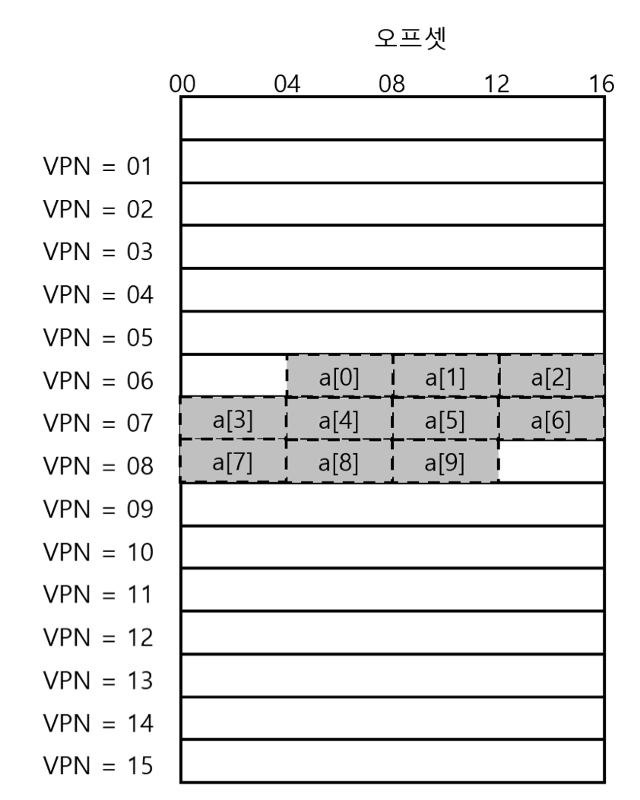
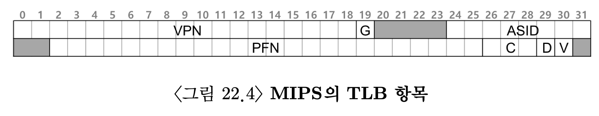

# 페이징 : 더 빠른 변환(TLB)

페이징은 상당한 성능 저하를 가져올 수 있음.
- 프로세스 주소 공간을 작은 고정된 크기로 나누고 페이지의 실제 위치(매핑 정보)를 메모리에 저장함.
- 메핑 정보 저장을 위해서는 큰 메모리 공간이 요구됨
- 모든 로드/스토어 명렁어 실행이 추가적인 메모리 읽기를 수반하는 상황을 가정하면 성능저하 극대화 가능성 시사.

```
주소 변환 속도를 어떻게 향상 시키지?
페이징 에서 발생하는 추가 메모리 참조를 어떻게 피할 수 있지?
어떤 하드웨어가 추가로 필요하지?
운영체제가 어떻게 개입해야하지?
```

운영체제의 실행속도 개선을 위해서는 도움이 필요.  
대부분 하드웨어로부터 도움을 받는다.  
예를 들어 변환-색인 버퍼(TLB)가 있음.

## 1. TLB의 기본 알고리즘
- TLB는 칩의 메모리 관리부(MMU)의 일부
- 주소변환 캐시
  - 자주 참조되는 가상주소-실주소 변환정보를 저장하는 하드웨어 캐시라고 볼 수 있음
    - 가상 메모리 참조시, 하드웨어는 TLB에 원하는 변환 정보가 있는지 확인함.
    - 있다면 페이지 테이블을 생략하고 변환을 빠르게 수행
- 실질적으로 페이징 성능을 엄청나게 향상시킴.
- 이를 도입하므로써 페이징이 "사용가능"한 가상 메모리 기법이 됨.  

알고리즘은 다음과 같이 동작한다
1. 가상 주소에서 가상페이지 번호를 추출, 해당 VPN의 TLB 존재 여부 검사
   - 만약 존재한다면 TLB히트(TLB가 변환값을 갖고 있다는 것)
   - 해당 TLB항목에서 페이지 프레임 번호(PFN)을 추춣할 수 있음
2. 해당 페이지에 대한 접근 권한 겁사가 성공하면 그 정보를 원래 가상 주소의 오프셋과 합쳐 원하는 물리주소를 구성하고 메모리에 접근할 수 있음.
3. TLB에 변환 정보가 존재하지 않는다면?
   1. 하드웨어가 변환정보를 찾기 위해 페이지 테이블에 접근
   2. 프로세스가 생성한 가상 메모리 참조가 유효하고 접근 가능할시 해당 변환 정보를 TLB로 읽어들임.
   - 이는 매우 많은 시간이 소요되는 작업
4. TLB가 갱신되면 하드웨어는 명령어를 재싫행
5. 이번에는 TLB에 변환정보가 존재하기에 메모리 참조가 빠르게 일어남.

```
모든 캐시의 설계 철학
> 주소 변환 정보가 대부분의 경우 캐시에 있다.
TLB역시 이를 전제로 만들어짐
```
</br>

- TLB는 프로세싱 코어와 가까이 위치하고 있고, 매우 빠른 하드웨어로 구성되어 있어 주소 변환은 부담스러운 작업은 아님.
- 미스가 발생할 경우 페이징 비용이 커짐.
  - 페이지 테이블에 접근하여 변환 정보를 찾아야함
  - 메모리 참조가 추가됨
- 이러한 상황이 자주 일어나면 프로그램이 상당히 느려짐

즉, TLB미스가 발생하는 경우를 최대한 피해야 함.

## 2. 예제 : 배열 접근
TLB 작동 과정 예제
    

- 가상 주소 100번지 부터 10개의 4바이트 크기 정수배열이 존재.
- 가상 주소 공간은 8비트
- 페이지 크기는 16바이트
- 가상 주소는 4비트 VPN과 4비트 오프셋으로 구성  

```c
int sum = 0;
for (i = 0; i < 10; i++)
{
	sum += a[i];
}
```

- 메모리 접근을 단순화하기 위해 i, sum 등 기타 메모리 접근은 무시
- 정수배열 접근만 볼 것
   1. a[0]접근시 하드웨어는 vpn추출.
   2. TLB에서 해당 VPN 검색(TBL이 완전 초기화 되어있다 가정)
   3. 첫 접근이므로 TLB미스 발생
   4. 해당 VPN에 대한 물리 페이지 번호를 찾아 TLB 갱신
   5. a[1] 접근
   6. TLB히트 발생
       - 배열의 투 번째 항목은 첫 번째 항목과 같은 페이지에 존재.
       - 첫 번째 항목을 읽을 때 이미 해당 페이지를 접근하였기에 필요한 변환정보가 이미 TLB에 탑재되어있음.
	7. a[2]에 접근시에도 같은 식으로 TLB사용에 성공
	8. a[3]에 접근시 TLB미스 발생
	9. a[4]~[6]까지 TLB히트 발생  
	...

배열 원소를 읽는 TLB 동작을 정리하면 TLB 히트 비율은 70%가 됨.
- 배열이 처음으로 접근되었지만, TLB는 공간지역성으로 인해 성능을 개선할 수 있음.
- 배열의 항목들이 페이지 내에서 서로 인접해 있기 때문에 가능.
- 이번 예제를 통해 페이지 크기가 TLB 효율에 매우 중요한 역할을 함을 알 수 있음.

만약, 예제 프로그램이 루프 종료 후에도 배열을 사용한다면 성능은 더욱 개선될 것.
- 모든 주소 변환 졍보가 TLB에 탑재되어 있기 떄문
- TLB가 모든 주소변환 정보를 저장할 정도로 충분히 크면 히트을 계속 얻을 수 있음
  - 이 경우 시간지역성으로 인해 히트율이 높아지는 것.
    - 시간지역성 : 한 번 참조된 메모리 영역이 짧은 시간 내에 재 참조되는 현상
- 다른 캐시와 마찬가지로 TLB 성공여부는 프로그램의 공간 지역성과 시간 지역성 존재 여부에 달림.


## TLB 미스는 누가 처리할까
두 가지 방법이 있음
1. 하드웨어
2. 소프트웨어(운영체제)  

</br>

RISC(reduced instruction set computing)는 CISC보다 최근에 등장한 컴퓨터 구조.
- 소프트웨어 관리 TLB를 사용
- RISC 기반 컴퓨터에서 TLB미스를 처리하는 과정 핵심
	- TLB에서 주소찾기 실패시 하드웨어는 예외 시그널 발생시킴
	- 시그널을 받은 운영체제는 명령어 실행을 잠정중단 및 실행모드를 커널모드로 변경하여 커널 코드 실행을 준비.
	- 커널모드 변경시 트랩 핸들러를 실행.
    	- 이 때 실행되는 트랩핸들러는 TLB미스 처리를 담당하는 운영체제 코드임
  	- 트랩 핸들러는 페이지 테이블을 검색하여 변환 정보를 찾고 TLB 접근가능한 특권 명령어를 통해 TLB 갱신후 리턴
  	- 리턴되면, 하드웨어가 명령어를 재실행
- 운영체제는 트랩 발생 원인에 따라 현재 명령어의 PC값 혹은 다음 명령어의 PC값을 저장해야 함.
- TLB미스 핸들러 실행시 미스가 무한반복되지 않도록 주의해야 함.

TLB를 소프트웨어로 관리하는 방삭의 주된 장점은 유연성 + 단순함


## TLB의 구성 : 무엇이 있나?

하드웨어 TLB의 구성을 좀 더 상세히 살펴보기.
- TLB는 일반적으로 32, 64, 혹은 128개의 엔트리를 가지며, 완전연관 방식으로 설계됨
  - 완전연관 방식에서 변환 정보는 TLB내의 어디든 위치 가능
  - 원하는 변환 정보를 찾는 검색은 TLB 전체에서 병렬적으로 수행

```
TLB의 구성
VPN | PFN | 다른 비트들
```

- 변환 정보 저장 위치에 제약이 없도록, 각 항목마다 가상 페이지 번호(VPN)와 물리 페이지 번호(PFN)가 있음.
  - 변환 주소를 찾을 때 하드웨어는 TLB의 각 항목을 동시검색함.


## TLB의 문제 : 문맥 교환

TLB에 있는 가상 주소와 실제 주소간의 변환정보는 그것을 탑재시킨 프로세스에서만 유효함.  
새로운 프로세스에서 이전 프로세스의 변환 정보를 사용하지 않도록 주의해야 함.

```
핵심질문 : 문맥 교환 시 TLB내용을 여떻게 관리하는가?
문맥교환시 실행될 프로세스에게 이전 프로세스의 TLB정보는 의미가 없음.
```
해결책
1. 문맥교환 수행시 다음프로세스 실행전 기존 TLB내용 비우기.
   - 문맥교환 시 마다 TLB를 비우면 잚못된 정보사용을 방지할 수 있음
   - 단점
     - 새로운 프로세스 실행마다 TLB미스가 발생함.
     - 문맥 교체가 빈번한 상황에서 성능에 큰 부담을 가져옴
   - 개선
     - 문맥 교환이 발생하더라도 TLB내용을 보존할 수 있는 하드웨어 기능을 추가
       - TLB내에 주소공간 식별자(ASID)필드 추가


## 이슈 : 교체 정책
모든 캐시가 그러하듯, TLB에도 캐시 교체 정책이 매우 중요함.

TLB에 새로운 항목을 탑재할 때, 현재 존재하는 항목중 하나를 교체 대상으로 선정해야 함.
- 최저사용빈도(LRU) 항목을 교체하기
  - LRU는 메모리 참조 패턴에서의 지역성을 최대한 활용하는 것이 목적
    - 사용되지 않는지 보며 앞으로도 사용될 가능성이 작으며 교체 대상으로 적합하다는 가정에 근거함
- 랜덤 정책
  - 교체 대상을 무작위로 정함


## 실제 TLB
    
