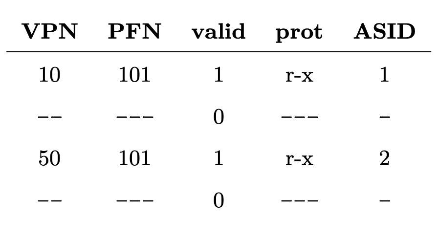

# 페이징: 더 빠른 변환(TLB)

page table 접근을 위한 메모리 읽기 작업은 엄청난 성능 저하 유발 <br>
주소 변환 속도를 어떻게 향상할까? <br>
-> TLB 도입 <br>
TLB: Translation-lookaside buffer <br>
- Memory-management unit(MMU)(address-translation cache)의 일부 <br>
- 가상 메모리를 참조하여 TLB에 원하는 정보가 있는지 확인<br>
	-> 있다면 page table을 통하지 않고 변환 수행 <br>
	-> page의 성능 향상, paging을 사용가능한 가상메모리 기법으로 만듦


## 22.1 TLB의 기본 알고리즘
```c
// VPN 추출
VPN = (VirtualAddress & VPN_MASK) >> SHIFT
// 해당 VPN의 TLB 존재여부 검사
(Success, TlbEntry) = TLB_Lookup(VPN)
// 존재한다면 TLB 히트
if (Success == True)
	// PFN(page frame number) 추출하여 해당 page에 대한 접근권한 검사
	if (CanAccess(TlbEntry.ProtectBits) == True)
		// 그 정보를 원해 가상 주소의 오프셋과 합쳐서
		Offset = VirtualAddress & OFFSET_MASK
		// 원하는 물리주소(PA) 구성
		PhysAddr = (TlbEntry.PFN << SHIFT) | Offset
		// 메모리에 접근 가능
		AccessMemory(PhysAddr)
    else
        RaiseException(PROTECTION_FAULT)
else // TLB 미스
	// page table에 접근
	PTEAddr = PTBR + (VPN * sizeof(PTE))
	PTE = AccessMemory(PTEAddr)
	if (PTE.Valid == False)
		RaiseException(SEGMENTATION_FAULT)
	else if (CanAccess(PTE.ProtectBits) == False)
		RaiseException(PROTECTION_FAULT)
	// 가상 메모리 참조가 유효하고 접근 가능하다면
	else
		// 해당 정보를 TLB로 읽어들임
		TLB_Insert(VPN , PTE . PFN , PTE . ProtectBits)
		RetryInstruction()
```

## 22.2 예제: 배열접근
int a[10]의 배열이 있다고 가정


a[0]: VPN = 6. TLB 미스, TLB 갱신 <br>
a[1]: TBL 히트 <br>
... <br>
a[3]: TLB 미스 <br>
... <br>
<br>
TLB는 <strong>공간지역성(spatial locality)</strong>와 <strong>시간지역성(temporal locality)</strong>로 개선 가능, 페이지 크기가 클수록 효용성이 높아짐 <br>
공간 지역성: 서로 인접할 시 첫 항목 접근 때만 TLB 미스 <br>
시간 지역성: 한 번 참조된 메모리 영역이 짧은 시간 내 재참조되는 현상

## 22.3 TLB 미스는 누가 처리할까

1. CISC(Complex-instruction set computers) 기반: 하드웨어 <br>
	1. page table에서 원하는 PTE 찾기
	2. 필요한 정보 추출
	3. TLB 갱신
	4. TLB 미스가 발생한 명령어 실행
2. RISC(Reduced instruction set computing) 기반: 소프트웨어 <br>
	1. TLB 미스 시 HW는 예외 시그널 발생
	2. 실행모드: 커널모드로 변경, 커널 코드 실행 준비
		- 커널 주소 공간을 접근할 수 있도록 특권 레벨로 상향 조정함
	3. trap handler 발생
		- trap handler: TLB 미스의 처리를 담당하는 운영체제 코드
		- page table을 검색하여 변환정보를 찾고, TLB 접근이 가능한 특권 명령어를 사용하여 TLB 갱신, 리턴
	4. HW 재실행


NOTE <br>
1. 시스템콜 trap handler 와 달리, trap handler 발생 후 다음 명령어가 아닌, 트랩을 발생시킨 명령어를 재실행함. <br>
-> 현재 명령어의 PC(Program Counter) 값 저장
2. TLB 미스가 무한 반복되지 않도록 주의. <br>
	무한 미스를 막는 법
	- 주소 변환이 필요없도록 TLB 미스 핸들러를 물리 메모리에 위치
	- TLB handler 가 항상 TLB 에서 히트되도록 TLB의 일부를 핸들러 코드 주소를 저장하는데 영구히 할당
3. SW로 관리할 때의 장점 <br>
	1. 유연성: HW 변경 없이 page table 구조를 자유롭게 변경 가능
	2. 단순함: 미스 발생 시 HW는 별로 할 일이 없음

## 22.4 TLB 구성: 무엇이 있나?

HW TLB를 살펴보면 일반적인 TLB는 32, 64 또는 128개의 엔트리를 가짐 <br>
완전 연관 방식으로 설계 <br>
&emsp;-> 변환 정보는 TLB 내 어디든 위치 가능, 원하는 변환 정보를 찾는 검색은 TLB 전체 내에서 병렬적으로 수행

```c
VPN | PEN | 다른 비트들
// 다른 비트들: valid bit, protection bit, 주소공간 식별자, dirty bit ...
```

## 22.5 TLB의 문제: 문맥 교환

TLB에 있는 가상 주소와 실제 주소 간의 변환 정보는 그것을 탑재시킨 프로세스에서만 유효함. <br><br>
<strong>multi process에서 문맥 교환 시 TLB 내용을 어떻게 관리하는가? </strong><br>
1. 문맥 교환 시 다음 프로세스는 실행 전 모든 valid bit을 0으로 설정하여 기존 TLB 내용 지우기
	- 새로운 프로세스 실행 시 데이터, 코드 페이지에 대한 접근으로 인한 TLB 미스 발생
2. TLB 내 주소공간 식별자(address space identifier, ASID) 필드 추가
	
	- 프로세스 별 TLB 변환 정보 구분 가능
3. TLB의 두 항목이 매우 유사한 경우 코드 페이지 공유
	- 물리 페이지 수 줄어듦
	- 메모리 부하 줄어듦

NOTE <br>
TLB valid bit != page table valid bit <br>
TLB valid bit: 해당 page가 process에 할당 되었는지 확인 <br>
page table valid bit: TLB에 탑재되어있는 해당 변환 정보가 유효한지 확인

## 22.6 이슈: 교체 정책
TLB에 새로운 항목을 탑재할 때 현존하는 항목 중 하나를 교체 대상으로 선정해야 함 <br>
<br>
<strong>TLB 교체 정책은 어떻게 설계하는가?</strong> <br>
1. 최저 사용 빈도(least-recently-used, LRU) 항목 교체 <br>
	: 지역성 활용
2. random 정책 <br>
	: 구현 간단, 예외 상황 피할 수 있음

## 22.7 실제 TLB


MISP R4000: SW로 관리되는 TLB 사용 <br>
<br>
G(전역 비트): 프로세스 간 공유되는 페이지들을 위해 사용, ASID 무시 <br>
C(일관성 비트): page가 HW에 어떻게 캐시되어 있는지 판별 <br>
dirty bit: page 가 갱신되면 세팅 <br>
valid bit: 유효한 변환 정보 존재 여부 <br>
page mask 필드: 여러 개의 page 크기 지원할 때 사용 <br>
회색 처리된 비트는 사용하지 않음 <br>
<br>
일반적으로 32개나 64개의 항목 사용 <br>
대부분은 사용자 프로세스들이 사용하지만, 몇 개는 운영체제를 위해 예약되어 있음 <br>
이는 TLB 미스가 발생해서는 안되는 코드나 데이터를 위해 사용됨 <br>
<br>
<strong>TLB를 갱신하기 위한 네 가지 명령어</strong> <br>
1. TLBP: 어떤 특정 변환 정보 존재여부 탐색
2. TLBR: TLB 항목을 레지스터로 읽어들임
3. TLBWT: TLB 항목 교체
4. TLBWR: 임의의 TLB 항목 교체

-> 이 명령어들은 특별한 실행권한을 가지고 있어야 함