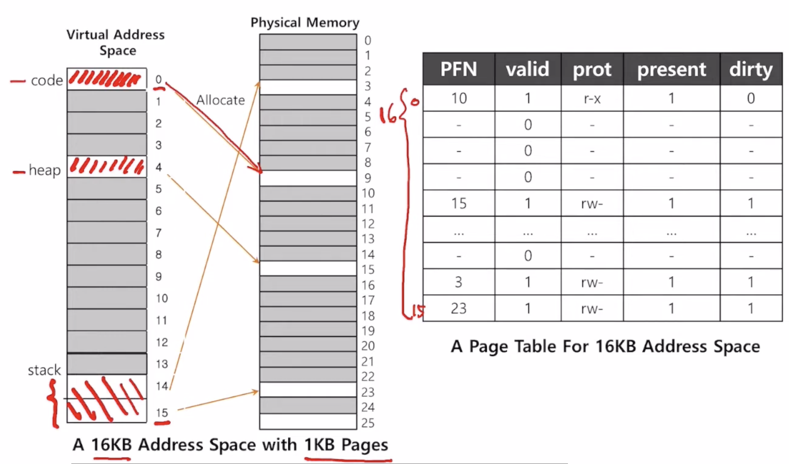
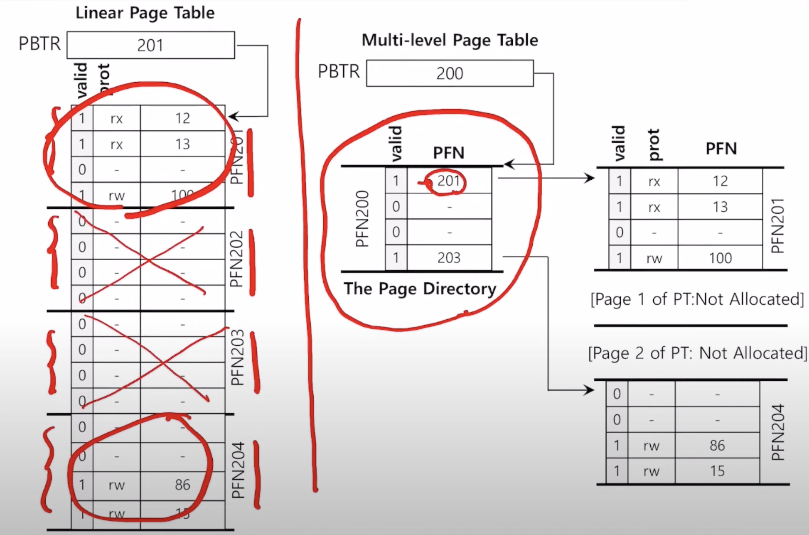

# 23 페이징: 더 작은 테이블

일반적으로 하나의 프로세스는 하나의 페이지 테이블을 가진다. <br>
->메모리 부담이 있음 <br>
<br>
<strong>페이지 테이블을 어떠헤 더 작게 만들까?</strong>

## 23.1 간단한 해법: 더 큰 페이지
page의 크기를 4배 증가시킨다면, page table 의 크기는 1/4로 감소 <br>
단점: 내부 단편화(내부의 낭비 공간 증가)



## 23.2 하이브리드 접근 방법: 페이징과 세그멘트
코드, 힙, 스택 세그멘트에 페이지 테이블을 각각 두는 것 <br>
<br>
base register: 세그멘트 물리 주소 시작 위치 나타냄<br>
bound register or limit register: 세그메트 물리 주소의 끝 또는 크기를 나타냄 <br>
<br>
TLB 미스 시 이루어지는 동작
```c
// segment bit을 이용하여 어떤 베이스와 바운드 쌍을 사용할지 결정
SN = (VirtualAddress & SEG_MASK) >> SN_SHIFT
// virtual page number 얻기
VPN = (VirtualAddress & VPN_MASK) >> VPN_SHIFT
// page table entry 주소 얻기
AddressOfPTE = Base[SN] + (VPN * sizeof(PTE))
```

각 바운드 레지스터의 값은 세그멘트의 최대 유효 페이지의 개수를 나타냄 <br>
ex) 0, 1, 2를 code segment로 사용 중이면 코드 세그멘트 페이지 테이블은 세 개의 항목만 할당 받을 수 있음.<br>
바운드 레지스터는 3.<br>
해당 범위가 넘어가는 곳에 대한 메모리 접근은 예외 발생, 프로세스 종료 <br>
<br>
단점: 페이지 테이블의 낭비 발생 <br>
&emsp;&emsp;ex)중간이 할당되지 않은 힙 경우 공간 낭비 <br>
&emsp;외부 단편화

## 23.3 멀티 레벨 페이지 테이블
선형 페이지 테이블을 트리 구조로 표현 <br>



page directory entires(PDE)들로 구성. <br>
PDE는 유효 비트(PDE가 가리키고 있는 페이지들 중 최소한 하나가 유효한가?)와 페이지 프레임 번호를 가지고 있음

<br>
page table 을 page 크기의 단위로 나눔 <br>
-> 페이지 테이블의 페이지가 유효하지 않은 항목만 있으면, 해당 페이지를 할당하지 않음. <br>
page directory라는 자료구조를 사용하여 페이지 테이블 각 페이지의 할당 여부와 위치 파악 <br>
<br>

<strong>장점</strong>
1. 사용하고 있는 주소 공간 양만큼만 할당
2. 운영체제는 페이지를 할당하거나 페이지 테이블을 확장할 때 free 페이지 풀에 있는 빈 페이지를 가져다 쓰면 됨

<strong>단점</strong>
1. PTE 탐색이 비쌈 <br>
	: TLB 미스 시 페이지 디렉터리와 PTE 접근을 위해 각각 한 번씩, 즉 두 번의 메모리 로드가 발생함. 메모리 접근 시간 증가.
2. 복잡도 <br>
	: 메모리 자원의 절약을 위해 페이지 테이블 검색을 좀 더 복잡하게 만듦 <br>

#### 멀티 레벨 페이징 예제
